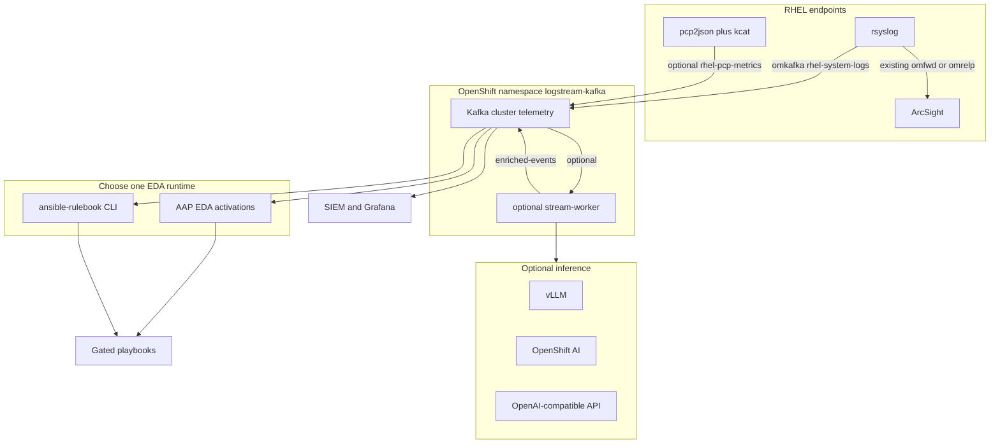

# 1. Architecture

This chapter defines the topic contracts, listeners, and consumer groups used everywhere else in the book.

RHEL syslog (and optionally Performance Co-Pilot metrics) stream into Apache Kafka on OpenShift, then fan out to Event-Driven Ansible (EDA) and SIEM in parallel. Predictive analytics is an **optional** later chapter: you can automate the ten syslog events without a stream worker or LLM.

## 1.1 Design goals

- **Existing ArcSight forwarding stays in place.** rsyslog dual-homes: the current SIEM path plus Kafka `omkafka`. This pack never replaces `/etc/rsyslog.conf` or other drop-ins.
- **KRaft Kafka** (no ZooKeeper). Streams for Apache Kafka 3.0 and later deploy Kafka in KRaft mode only.
- **One topic contract** so EDA, SIEM, and an optional worker can be added independently.
- **Predictive analytics is optional**. PCP time-to-exhaustion and LLM classification live in [chapter 6](06-optional-predictive-ai-worker.md).
- **Remediation is gated**. Playbooks collect diagnostics or notify by default. Firewall bans, restarts, IPMI, disk prune, and LVM extend require explicit extra vars.

## 1.2 Logical topology



## 1.3 Kafka cluster shape

| Pool | Replicas | Role | Persistent volume |
| --- | --- | --- | --- |
| `controller` | 3 | KRaft quorum | 20Gi per node |
| `broker` | 3 | Data and listeners | 100Gi per node |

Manifests: [openshift/kafka/](../openshift/kafka/). Procedure: [chapter 3](03-kafka-openshift.md).

Listeners:

| Name | Port in Kafka CR | How clients connect |
| --- | --- | --- |
| `plain` | 9092 | In-cluster plaintext: `telemetry-kafka-plain-bootstrap.logstream-kafka.svc:9092` |
| `tls-external` | 9094 | OpenShift Route **passthrough TLS**. Producers on RHEL use the Route hostname on **TCP 443**. |

OpenShift Routes listen on 443 even when the Kafka listener inside the cluster is 9094. RHEL `omkafka` and `kcat` must use `host:443` with `security.protocol=ssl` and the cluster CA.

## 1.4 Topic data contracts

| Topic | Retention | Producers | Consumers | Payload |
| --- | --- | --- | --- | --- |
| `rhel-system-logs` | 7 days | rsyslog `omkafka` (in addition to ArcSight) | EDA, SIEM | RFC-3339 JSON syslog |
| `rhel-pcp-metrics` | 3 days | `pcp2json` via `kcat` | Optional worker, Grafana/SIEM | PCP JSON samples |
| `raw-metrics` | 1 day | Optional extra producers | Optional worker | JSON metrics |
| `enriched-events` | 3 days | Optional stream worker | Optional EDA rulebook, SIEM | Predictive alerts and optional LLM fields |

### Syslog JSON (`rhel-system-logs`)

```json
{
  "@timestamp": "2026-04-10T12:00:00.000000+00:00",
  "host": "app01.example.com",
  "severity": "err",
  "facility": "kern",
  "syslogtag": "kernel",
  "message": "Out of memory: Kill process 1234"
}
```

### Enriched event JSON (`enriched-events`)

```json
{
  "@timestamp": "2026-04-10T12:01:00Z",
  "host": "app01.example.com",
  "type": "PREEMPTIVE_STORAGE_EXHAUSTION_RISK",
  "mount": "/var",
  "capacity_bytes": 107374182400,
  "used_bytes": 96636764160,
  "rate_bytes_per_sec": 1048576,
  "tte_seconds": 10240,
  "severity_score": 80,
  "classification": "storage_exhaustion",
  "explanation": "optional LLM text"
}
```

The string `PREEMPTIVE_STORAGE_EXHAUSTION_RISK` is the **optional** EDA match key. Do not rename it without changing [ansible/eda/rulebook-optional-predictive.yml](../ansible/eda/rulebook-optional-predictive.yml). The ten syslog rules use [ansible/eda/rulebook.yml](../ansible/eda/rulebook.yml).

## 1.5 Consumer groups

Never share a `group.id` across independent consumers. Kafka delivers each partition message to only one member of a group.

| Component | `group.id` |
| --- | --- |
| Optional stream worker | `stream-worker` |
| Event-Driven Ansible | `ansible-eda` |
| Logstash | `siem-logstash` |
| Splunk Connect for Kafka | `siem-splunk` |

## 1.6 Optional predictive calculation

For a capacity metric (disk or inode pool), time-to-exhaustion is:

```text
TTE = (Capacity - Used_current) / (ΔUsed / Δt)
```

`ΔUsed / Δt` is the fill rate over the rolling window. If that rate is zero or negative (usage is flat or shrinking), the worker does not emit an exhaustion alert. Implementation: [worker/](../worker/). Skip this section if you are not deploying [chapter 6](06-optional-predictive-ai-worker.md).

## 1.7 Where to start

| Your environment | Start at |
| --- | --- |
| First time with this pack | [Introduction](index.md), then this chapter |
| Greenfield OpenShift + RHEL | [Prerequisites](02-prerequisites.md) then [Kafka on OpenShift](03-kafka-openshift.md) |
| Existing Streams for Apache Kafka 3.x KRaft cluster | Create the four topics and listeners, then [RHEL telemetry](04-rhel-telemetry.md) |
| Telemetry already in Kafka | [Event-Driven Ansible](05-event-driven-ansible.md); optional [predictive worker](06-optional-predictive-ai-worker.md) |
| Proof of pipeline | [Validation](07-validation-runbook.md) |

## 1.8 Decision matrices

Inference and EDA are independent choices. Document your selection in your change ticket.

**EDA runtime ([chapter 5](05-event-driven-ansible.md))**

| Option | When to use |
| --- | --- |
| AAP 2.5 or 2.6 Event-Driven Ansible | Production activations, RBAC, decision environments. Use 2.6 on OCP 4.21 |
| `ansible-rulebook` CLI | Lab, jump host, or before AAP is available |

**Inference ([optional chapter 6](06-optional-predictive-ai-worker.md))**

| Option | When to use |
| --- | --- |
| None | Predictive TTE only; `INFERENCE_BASE_URL` empty |
| vLLM on OpenShift | You operate a GPU inference service with an OpenAI-compatible `/v1` |
| Red Hat OpenShift AI | You already serve a model with an OpenAI-compatible endpoint |
| External OpenAI-compatible API | SaaS or remote gateway; requires egress and a secret API key |

Both EDA runtimes consume the same [ansible/eda/](../ansible/eda/) rulebook and playbooks.

## Next

Continue with [Prerequisites](02-prerequisites.md).
