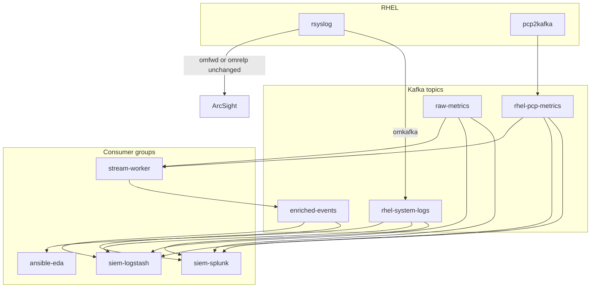

# 8. SIEM and Dashboards

Wire parallel SIEM consumers and Grafana operations views. Kafka cluster `telemetry` in namespace `logstream-kafka` remains the system of record. Event-Driven Ansible (`ansible-eda`) **must keep an exclusive consumer group**. If you deploy the optional predictive worker, it uses `stream-worker` exclusively. SIEM uses only `siem-logstash` and `siem-splunk`.

Validation of produce/consume paths is in [Validation](07-validation-runbook.md).

## 8.1 Architecture



Host-level ArcSight stays on rsyslog. Kafka-side SIEM (this chapter) is a **parallel** consumer of the same topics, not a replacement for ArcSight. Do not reuse `ansible-eda` or `stream-worker` as a SIEM group. The optional worker is not required for syslog SIEM.

| Topic | Typical producers | SIEM index / sourcetype hint |
|-------|-------------------|------------------------------|
| `rhel-system-logs` | rsyslog `omkafka` | `rhel-system-logs-*` / syslog JSON |
| `rhel-pcp-metrics` | `pcp2kafka.service` | `rhel-pcp-metrics-*` |
| `raw-metrics` | optional extra producers | `raw-metrics-*` |
| `enriched-events` | optional stream worker | `enriched-events-*` |

### Syslog catalog detections (SIEM)

Correlate in SIEM even when EDA gates are closed. Patterns match [chapter 5](05-event-driven-ansible.md).

| Event | Search / identifier | SIEM value |
| --- | --- | --- |
| OOM killer | `Out of memory: Kill process` | Memory exhaustion trends across host groups |
| Failed SSH / brute force | `Failed password` or `authentication failure` | Alert on more than five failures in one minute |
| Sudo failures | `incorrect password attempt` | Unauthorized access / insider threat |
| SELinux AVC | `type=AVC` / `msg=audit` | Broken apps vs malicious escalation |
| systemd failed | `Failed to start` / `entered failed state` | Uptime and SLA |
| Disk I/O | `I/O error`, `EXT4-fs error`, `XFS: corrupt` | Critical infrastructure |
| User/group mods | `useradd`, `usermod`, `groupadd`, `USER_MGMT` | PCI-DSS, SOC 2, HIPAA |
| Panic / MCE | `Kernel panic - not syncing`, `MCE: Hardware error` | Hardware mortality |
| Link down | `state is now DISCONNECTED`, `link down` | Topology disruption |
| DNF/YUM install | `Installed:` | Inventory and drift |

Config files:

- [siem/logstash-kafka.conf](../siem/logstash-kafka.conf)
- [siem/splunk-connect-kafka.yaml](../siem/splunk-connect-kafka.yaml)
- [grafana/kafka-throughput-lag.json](../grafana/kafka-throughput-lag.json)
- [grafana/pcp-system-metrics.json](../grafana/pcp-system-metrics.json)

## 8.2 Prerequisites checklist

| Step | Action | Pass | Fail |
|------|--------|------|------|
| P1 | Chapters 03–05 complete; [07](07-validation-runbook.md) E1–E4 preferably Pass | Pipeline already produces | Empty topics |
| P2 | Prometheus scrapes Strimzi / Kafka Exporter (for Grafana Kafka dashboard) | `kafka_consumergroup_lag` or `kafka_server_brokertopicmetrics_*` present | No Kafka metrics |
| P3 | Optional: PCP via pmproxy Prometheus or equivalent for [pcp-system-metrics.json](../grafana/pcp-system-metrics.json) | CPU/mem/filesys series exist | Use Kafka messages-in panel only |
| P4 | Elasticsearch/HEC endpoints reachable from SIEM consumers | TLS and tokens valid | 401/timeout |
| P5 | NetworkPolicy/SCC allow SIEM pods to `telemetry-kafka-plain-bootstrap.logstream-kafka.svc:9092` (or Route **443**) | TCP connect succeeds | Policy drop |

## 8.3 Grafana: import Kafka throughput and lag

1. Grafana → **Dashboards** → **Import**.
2. Upload [grafana/kafka-throughput-lag.json](../grafana/kafka-throughput-lag.json) (UID `logstream-kafka`).
3. Select the Prometheus datasource that scrapes the OpenShift user workload / user-workload monitoring or your Strimzi PodMonitor.
4. Confirm variables:
   - `namespace` = `logstream-kafka`
   - `cluster` = `telemetry`
   - `topic` regex includes `rhel-system-logs`, `rhel-pcp-metrics`, `raw-metrics`, `enriched-events`
   - `group` regex includes `ansible-eda`, `stream-worker`, `siem-logstash`, `siem-splunk`
5. Set time range `now-1h`, refresh `30s`.
6. Generate traffic with [scripts/inject-oom-log.sh](../scripts/inject-oom-log.sh) if the cluster is idle ([runbook](07-validation-runbook.md)).

| Step | Pass | Fail |
|------|------|------|
| G1 | Import succeeds without JSON schema errors | Invalid JSON / wrong Grafana version — use Grafana 9+ / 10 |
| G2 | Active controller = 1; under-replicated = 0 | Controller election or disk issues |
| G3 | Messages/bytes in > 0 on syslog and PCP topics while hosts produce | Wrong datasource or topic labels |
| G4 | Lag panel shows **separate** series per group after SIEM is on | SIEM missing or sharing `ansible-eda` |
| G5 | After OOM inject, `rhel-system-logs` rate ticks up | omkafka not producing |

## 8.4 Grafana: import PCP system metrics

1. Import [grafana/pcp-system-metrics.json](../grafana/pcp-system-metrics.json) (UID `logstream-pcp`).
2. Bind the same or a pmproxy Prometheus datasource.
3. If PCP names differ in your scrape (prefix `pcp_` vs raw `filesys_used`), panels use `or` fallbacks; adjust PromQL if your exporter uses another convention.
4. Align with storage-fill: run `create` from [scripts/storage-fill-test.sh](../scripts/storage-fill-test.sh), confirm filesys used % rises, then **cleanup**.

| Step | Pass | Fail |
|------|------|------|
| M1 | Dashboard loads | Import error |
| M2 | Kafka messages-in for `rhel-pcp-metrics` / `raw-metrics` non-zero | pcp2kafka down (still useful as a pipeline panel) |
| M3 | Filesys used % increases during storage-fill, decreases after `rm` | Wrong instance selector or no PCP scrape |
| M4 | CPU/memory/load panels populate **or** are marked N/A with Kafka-only metrics | Silent empty dashboards without investigation |

## 8.5 Logstash (Elasticsearch)

1. Deploy Logstash (OpenShift Deployment or RHEL service) with the Kafka input from [siem/logstash-kafka.conf](../siem/logstash-kafka.conf).
2. Set `KAFKA_BOOTSTRAP` to `telemetry-kafka-plain-bootstrap.logstream-kafka.svc:9092` in-cluster, or the TLS Route on port 443 with SSL.
3. Confirm `group_id => "siem-logstash"` is unchanged.
4. Set `ES_HOSTS` and credentials via environment or keystore.
5. Restart Logstash and watch pipeline stats.
6. Inject a synthetic OOM ([scripts/inject-oom-log.sh](../scripts/inject-oom-log.sh)) and search Elasticsearch index `rhel-system-logs-*` for `test_oom` / `Out of memory: Kill process 1234` (tag `oom-test` in the sample filter).

Example in-cluster bootstrap check:

```bash
oc exec -n logstream-kafka <logstash-pod> -- \
  bash -c 'echo > /dev/tcp/telemetry-kafka-plain-bootstrap.logstream-kafka.svc/9092'
```

| Step | Pass | Fail |
|------|------|------|
| LS1 | Logstash running; Kafka input not stalled | `connection refused`, SSL handshake |
| LS2 | Group `siem-logstash` appears in Kafka Exporter / Grafana lag | Wrong `group_id` |
| LS3 | `siem-logstash` ≠ `ansible-eda` and ≠ `stream-worker` | Offset contention with EDA |
| LS4 | Documents in daily indices per topic | Mapping/codec errors (`json` parse) |
| LS5 | Synthetic OOM searchable | Filter dropped event |

Do not run two Logstash deployments with the same `group_id` unless they are a single logical consumer (shared group is then expected). Do not share that id with EDA.

## 8.6 Splunk Connect for Kafka

1. Install Splunk Connect for Kafka on a Strimzi `KafkaConnect` cluster in `logstream-kafka` (label `strimzi.io/cluster: telemetry-connect` in the sample).
2. Create a Splunk HEC token; substitute `splunk.hec.uri` and `splunk.hec.token` in [siem/splunk-connect-kafka.yaml](../siem/splunk-connect-kafka.yaml).
3. Apply:

```bash
oc apply -n logstream-kafka -f siem/splunk-connect-kafka.yaml
oc get kafkaconnector splunk-connect-kafka -n logstream-kafka
```

4. Confirm connector config `consumer.override.group.id` = `siem-splunk`.
5. Search Splunk for `index=main sourcetype=_json` (adjust to your index) after producing to `rhel-system-logs`.
6. Lag for `siem-splunk` must be independent of `siem-logstash`.

| Step | Pass | Fail |
|------|------|------|
| SP1 | `KafkaConnector` Ready / tasks running | Missing Connect cluster or plugin JAR |
| SP2 | Group `siem-splunk` only | Default Connect group stealing EDA offsets |
| SP3 | HEC 200s; events in Splunk | Cert validation or bad token |
| SP4 | Four topics listed on the connector | Typo in `topics` |
| SP5 | Parallel with Logstash: both groups lag independently | One consumer using the other's group id |

The Connect **worker** `group.id` (cluster membership) is not the sink consumer group. Only `consumer.override.group.id=siem-splunk` must remain distinct from `ansible-eda` / `stream-worker` / `siem-logstash`.

## 8.7 Combined operations checklist

| ID | Control | Pass | Fail |
|----|---------|------|------|
| C1 | Grafana Kafka dashboard imported; controller healthy | | |
| C2 | Grafana PCP dashboard imported or Kafka PCP rate panel used | | |
| C3 | Logstash `siem-logstash` consuming four topics | | |
| C4 | Splunk `siem-splunk` consuming four topics (if Splunk in scope) | | |
| C5 | EDA still matches OOM after SIEM enabled ([07 §7.5](07-validation-runbook.md)) | | |
| C6 | If the optional worker is deployed, it still publishes `enriched-events` after SIEM enabled ([07 §7.6](07-validation-runbook.md)) | | |
| C7 | Storage-fill image not left behind (`./scripts/storage-fill-test.sh cleanup`) | | |

**Fail on C5/C6** usually means SIEM reused `ansible-eda` or `stream-worker`. Fix group ids and restart SIEM only; do not reset EDA offsets unless instructed by Kafka operations.

## 8.8 Placeholder commands (oc / kcat)

```bash
# Connectors and topics
oc get kafkaconnector -n logstream-kafka
oc get kafkatopic -n logstream-kafka

# Bounded inspect (never -G ansible-eda / stream-worker / siem-*)
export BOOTSTRAP=telemetry-kafka-plain-bootstrap.logstream-kafka.svc:9092
kcat -b "${BOOTSTRAP}" -t enriched-events -C -o -5 -e -c 5 -G verify-pipeline

./scripts/verify-pipeline.sh groups
./scripts/verify-pipeline.sh all
```

## 8.9 Related files

| File | Role |
|------|------|
| [07-validation-runbook.md](07-validation-runbook.md) | Synthetic tests and pipeline sign-off |
| [scripts/verify-pipeline.sh](../scripts/verify-pipeline.sh) | oc/kcat placeholders |
| [scripts/inject-oom-log.sh](../scripts/inject-oom-log.sh) | SIEM search fixture |
| [scripts/storage-fill-test.sh](../scripts/storage-fill-test.sh) | PCP/Grafana filesys fixture |
| [grafana/kafka-throughput-lag.json](../grafana/kafka-throughput-lag.json) | Cluster throughput and lag |
| [grafana/pcp-system-metrics.json](../grafana/pcp-system-metrics.json) | Host PCP views |
| [siem/logstash-kafka.conf](../siem/logstash-kafka.conf) | Logstash Kafka input |
| [siem/splunk-connect-kafka.yaml](../siem/splunk-connect-kafka.yaml) | Splunk Connect sink |
