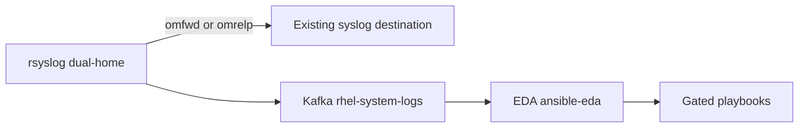

# Event-Driven Ansible

This chapter is the **core automation path**: RHEL syslog already dual-homed to an existing syslog destination and Kafka (`rhel-system-logs`) is matched by Event-Driven Ansible (EDA). Each of the ten catalog events below has a rule, a playbook, and a reason it matters to a security team. Predictive analytics is **not** required; skip the [optional predictive worker](../optional/predictive-ai-worker.md) unless you want PCP time-to-exhaustion.

Two runtimes are first-class: **Ansible Automation Platform (AAP) 2.5/2.6 rulebook activations** and the **`ansible-rulebook` CLI**. On OpenShift **4.21**, use AAP **2.6** (2.5 Operators stop at OCP 4.20). Artifacts live in `ansible/eda/`.

## What EDA consumes

| Stream | Topic | Typical payload | Rules |
| --- | --- | --- | --- |
| Host syslog (rsyslog / omkafka) | `rhel-system-logs` | JSON with `host`, `message`, `@timestamp` | Ten catalog rules in `rulebook.yml` |
| Optional worker ([Predictive worker](../optional/predictive-ai-worker.md)) | `enriched-events` | `alert_type` / `type` | `rulebook-optional-predictive.yml` only |

The `ansible.eda.kafka` source plugin takes **`host` and `port`**, not `bootstrap_servers`. JSON values are **`event.body`** (and flattened `event.message`).

**Consumer group `ansible-eda` is reserved for this rulebook.** Do not reuse it for `stream-worker`.

In-cluster bootstrap: `telemetry-kafka-plain-bootstrap.logstream-kafka.svc` port `9092`.



## Event catalog (syslog → EDA + SIEM)

Match strings are substrings of the rsyslog JSON `message` field (and `syslogtag` may still be `sshd`, `kernel`, `sudo`, and so on). Rules throttle per host so a log storm does not fork unbounded jobs.

| # | Event name | Match pattern / syslog identifier | EDA action (playbook) | SIEM value |
| --- | --- | --- | --- | --- |
| 1 | Kernel OOM killer invocation | `kernel: Out of memory: Kill process` | Collect diagnostics; optionally restart a named service, drop caches (`playbooks/remediate_oom.yml`) | Memory exhaustion trends across host groups |
| 2 | Failed SSH authentication / brute force | `sshd: Failed password for` or `PAM: authentication failure` | Optionally add nftables/firewalld drop for the source IP (`playbooks/ban_ssh_source.yml`) | Alert on more than five failed attempts in one minute (correlation in SIEM; EDA throttles 1 minute per host) |
| 3 | Sudo / privilege escalation failures | `sudo: ... : 1 incorrect password attempt` | Notify SOC / Slack (`playbooks/notify_soc.yml`) | Unauthorized access / insider-threat flag |
| 4 | SELinux policy violations | `type=AVC msg=audit` | Write an `audit2allow` diagnosis report; **never** auto-install a module (`playbooks/selinux_avc_report.yml`) | Broken applications vs malicious permission escalation |
| 5 | systemd service failure | `systemd: Failed to start` or `entered failed state` | Optionally `systemctl restart` up to N times (`playbooks/restart_failed_service.yml`) | Service uptime and SLA |
| 6 | Storage / disk I/O errors | `kernel: I/O error` or `EXT4-fs error` or `XFS: corrupt` | Diagnostics; optionally isolate from load balancer and record an urgent hardware ticket (`playbooks/isolate_host_io_error.yml`) | Critical infrastructure failure |
| 7 | User account and group modifications | `useradd`, `usermod`, `groupadd`, `USER_MGMT` | Log the change; optionally require an approved ticket ID (`playbooks/audit_user_mgmt.yml`) | PCI-DSS, SOC 2, HIPAA change audit |
| 8 | Kernel panic / machine check exception | `Kernel panic - not syncing` or `MCE: Hardware error` | Report; optionally IPMI chassis power cycle (`playbooks/ipmi_power_cycle.yml`) | Hardware mortality |
| 9 | Network link down / interface failure | `NetworkManager: state is now DISCONNECTED` or `link down` | Report; optionally `nmcli` down/up (`playbooks/reset_network_interface.yml`) | Topology disruption |
| 10 | Package install / DNF software | `dnf: Installed:` or `yum: Installed:` | Audit the `Installed:` line against an optional baseline file (`playbooks/audit_package_install.yml`) | Inventory tracking and image drift |

Destructive steps stay **fail-closed**. With default extra vars, playbooks collect evidence or notify; they do not ban IPs, restart units, isolate hosts, or power-cycle.

## Per-event automation notes

**OOM.** Default path writes `/var/tmp/eda-oom-diagnostics/`. Set `allow_service_restart=true` **and** `service_name` to restart a crashed unit. Set `allow_drop_caches=true` only in a change window (writes `/proc/sys/vm/drop_caches`). Memory scale-out is a human or platform action; this playbook does not resize VMs.

**SSH brute force.** Parses `from <ipv4>` on typical `sshd` lines. `allow_firewall_ban` must be true. Default backend is `firewalld` rich-rule drop; set `ban_firewall_backend: nftables` for `nft add rule inet filter input ...`. SIEM should still count `>5` failures per minute; EDA throttle is one playbook run per host per minute so you do not open a rule storm.

**Sudo failures.** Match substring `incorrect password attempt`. Set `slack_webhook_url` for an incoming webhook; otherwise the playbook only `debug`s the payload.

**SELinux AVC.** `ausearch` + `audit2allow -m eda_suggested` to `/var/tmp/eda-selinux/avc-report.txt`. `allow_selinux_module` only prints a reminder: this pack **does not** run `semodule -i`.

**systemd failed.** Parses `Failed to start <unit>` when `service_name` is empty. Restarts only if `allow_service_restart` is true, up to `restart_max_attempts` (default 3).

**Disk I/O.** Writes `/var/tmp/eda-io-error/io-error.txt`. Isolation is site-specific: set `allow_lb_isolate=true` **and** a reviewed `lb_isolate_command`. Ticket creation is the report plus your ITSM process.

**User/group.** `require_change_ticket=true` fails the job when `change_ticket_id` is empty so unapproved `USER_MGMT` is visible in AAP job history.

**Panic / MCE.** `allow_ipmi_reboot` runs `ipmitool chassis power cycle` on the **inventory host**. Keep this false unless out-of-band reset is approved for that host.

**Link down.** `allow_nmcli_reset` requires `nmcli_connection` (NetworkManager connection name).

**DNF/YUM.** Informational. If `package_baseline_file` is set on the control node, the playbook flags lines not present in that file.

## Decision matrix: AAP vs ansible-rulebook CLI

Treat both as production-capable. The difference is control plane, not the Kafka contract or playbooks.

| Criterion | AAP 2.5/2.6 rulebook activation | `ansible-rulebook` CLI |
| --- | --- | --- |
| Control plane | EDA controller schedules a long-running activation in a decision environment | Operator starts a process (systemd, Podman, or foreground) |
| Who runs playbooks | Automation controller via `run_job_template` | Local `ansible-runner` via `run_playbook` |
| RBAC and audit | Controller job history, org/team RBAC, credentials | OS user, sudo, and your SIEM around the CLI |
| Secrets | EDA/controller credential types; activation extra vars | `--vars` file, env, or mounted files (mode 0600) |
| Image | Decision environment (JRE + `ansible-rulebook` + `ansible.eda`) plus a controller EE for playbooks | Same DE image, or a venv with Java 17+ |
| HA / restart | Activation restart policy (`On failure` / `Always` / `Never`); platform HA | systemd `Restart=`; your orchestrator |
| Rulebook layout | Git project must expose `extensions/eda/rulebooks/` (or legacy `rulebooks/`) | Any path passed to `--rulebook` |
| When to use | Multi-team production, change control, job approval, central inventory | Labs, bootstrap before AAP is ready, air-gapped hosts, CI contract tests |
| When not to use | If you cannot place rulebooks on the scanned git paths or cannot mint a controller token | If you need multi-user audit of every remediation job without extra plumbing |

`run_playbook` is **CLI-only**. `run_job_template` is **AAP-only**. Do not enable an AAP activation against `rulebook.yml`.

## Shared artifacts

| Path | Role |
| --- | --- |
| `ansible/eda/execution-environment.yml` | ansible-builder v3 image: collections `ansible.eda`, `community.general`; Python `aiokafka`, `requests`, `numpy` |
| `ansible/eda/rulebook.yml` | CLI syslog catalog, `run_playbook` |
| `ansible/eda/aap-rulebook.yml` | AAP syslog catalog, `run_job_template` |
| `extensions/eda/rulebooks/aap-rulebook.yml` | Path AAP actually scans |
| `ansible/eda/rulebook-optional-predictive.yml` | Optional `enriched-events` (the predictive worker) |
| `ansible/eda/playbooks/*.yml` | One playbook per catalog event (+ optional disk TTE) |
| `ansible/eda/inventory/hosts.example.yml` | Sample `rhel_telemetry` inventory |
| `ansible/eda/vars/extra_vars.example.yml` | Kafka connection + safety gates (all destructive flags false) |
| `ansible/eda/aap-notes.md` | Click-path for project, decision environment, activation |

Copy `extra_vars.example.yml` to a non-committed file (for example `extra_vars.yml`) before adding passwords or key paths.

## Safety gates (both runtimes)

Defaults are fail-closed. Playbooks assert and skip rather than guess.

| Variable | Default | Effect when true |
| --- | --- | --- |
| `allow_service_restart` | `false` | Restart after OOM or systemd failure. Needs `service_name` or a parseable unit. |
| `allow_drop_caches` | `false` | `drop_caches=3` after OOM diagnostics |
| `allow_firewall_ban` | `false` | firewalld or nftables drop of parsed SSH source IP |
| `allow_selinux_module` | `false` | Reminder only; still no `semodule` |
| `allow_lb_isolate` | `false` | Run `lb_isolate_command` after I/O errors |
| `allow_ipmi_reboot` | `false` | `ipmitool chassis power cycle` |
| `allow_nmcli_reset` | `false` | `nmcli` down/up of `nmcli_connection` |
| `require_change_ticket` | `false` | Fail user-mgmt jobs without `change_ticket_id` |
| `allow_podman_prune` / `allow_lvextend` | `false` | Optional predictive playbook only (the predictive worker) |

After enabling any gate, re-close it in extra vars and restart the activation or CLI process so the next event cannot inherit a leftover true flag.

## Runtime A — AAP 2.5/2.6 (full admin steps)

Prerequisites: AAP **2.6** on OpenShift 4.20–4.21 (or AAP **2.5** only if the cluster is 4.20); Event-Driven Ansible and automation controller; a git remote AAP can clone over HTTPS; a container registry the controllers can pull; Kafka reachable from the activation network (in-cluster `host` + port `9092`, or the TLS route on **443**).

### A.1 Build and publish the decision environment

On a build host with `ansible-builder` and `podman`:

```bash
ansible-builder build \
  -f ansible/eda/execution-environment.yml \
  -t registry.example.com/aiops/logstream-eda-de:1.0
podman push registry.example.com/aiops/logstream-eda-de:1.0
```

The sample base image is `registry.redhat.io/ansible-automation-platform-26/de-minimal-rhel9:latest` (log in to `registry.redhat.io` first). Match the image stream to the AAP version on the cluster (`-25` only on OCP 4.20). `de-minimal` already contains `ansible.eda`. If the build errors on a reinstall, add `ansible.eda` to `dependencies.exclude.all_from_collections` and rebuild.

Use an AAP **execution environment** (not only the DE) on controller for playbooks so `community.general` is present at job runtime (`ee-minimal-rhel9` or `ee-supported-rhel9`).

### A.2 Place rulebooks where EDA scans

EDA imports **only** `extensions/eda/rulebooks/` or, if that path is absent, legacy `rulebooks/` at the git root. First path found wins; an empty `extensions/eda/rulebooks/` hides `rulebooks/`.

This repository already ships `extensions/eda/rulebooks/aap-rulebook.yml`. Leave `ansible/eda/` as the working tree for CLI users.

### A.3 Credentials

1. Log in to Event-Driven Ansible controller as a user who can create content.
2. Create an **SCM credential** for git HTTPS.
3. Create a **registry credential** if the DE image is private.
4. In automation controller, create an API **token** for a service user that can launch the job templates.
5. In EDA controller, store that token so activations can call controller.

### A.4 EDA project

1. **Projects** → **Create project**.
2. Name `logstream-kafka-eda`. SCM type Git. Paste the HTTPS URL and branch that contain `extensions/eda/rulebooks/`.
3. Attach the SCM credential. Keep SSL verification on unless you installed a private CA on the controller.
4. Save and wait for a successful sync. After every rulebook commit, **Sync** the project and **restart** the activation (activations pin a git hash).

### A.5 Decision environment object

1. **Decision Environments** → **Create decision environment**.
2. Name `logstream-eda-de`.
3. Image: full registry path including tag (or digest).
4. Attach the pull credential.
5. AAP pulls the image on every activation start (`Always`). Use immutable tags in production.

### A.6 Controller project, inventory, and job templates

1. In **automation controller**, create a Project on the same git repo.
2. Create an Inventory from `ansible/eda/inventory/hosts.example.yml` (replace example hosts; group `rhel_telemetry`).
3. Create one job template per playbook. Names must match extra vars (defaults in parentheses):

| Template name | Playbook |
| --- | --- |
| `remediate-oom` | `ansible/eda/playbooks/remediate_oom.yml` |
| `ban-ssh-source` | `ansible/eda/playbooks/ban_ssh_source.yml` |
| `notify-soc` | `ansible/eda/playbooks/notify_soc.yml` |
| `selinux-avc-report` | `ansible/eda/playbooks/selinux_avc_report.yml` |
| `restart-failed-service` | `ansible/eda/playbooks/restart_failed_service.yml` |
| `isolate-host-io-error` | `ansible/eda/playbooks/isolate_host_io_error.yml` |
| `audit-user-mgmt` | `ansible/eda/playbooks/audit_user_mgmt.yml` |
| `ipmi-power-cycle` | `ansible/eda/playbooks/ipmi_power_cycle.yml` |
| `reset-network-interface` | `ansible/eda/playbooks/reset_network_interface.yml` |
| `audit-package-install` | `ansible/eda/playbooks/audit_package_install.yml` |

4. Extra vars on every template: keep all `allow_*` flags **false**. No survey that defaults gates to true.
5. Grant the EDA token user **Execute** on all templates.

Organization must match `aap_organization` (default `Default`).

### A.7 Activation

1. **Rulebook Activations** → **Create rulebook activation**.
2. Project `logstream-kafka-eda`. Rulebook **`aap-rulebook.yml`**. Decision environment `logstream-eda-de`.
3. Restart policy **On failure** for production.
4. Variables: YAML from `ansible/eda/vars/extra_vars.example.yml` with a reachable `kafka_host` / `kafka_port`. For the OpenShift Route, set `kafka_port: "9094"`, `kafka_security_protocol: SSL` (or `SASL_SSL`), and certificate paths that exist **inside the DE**.
5. Keep `kafka_group_id: ansible-eda` and every `allow_*` flag false.
6. Enable the activation.

Watch activation logs until the syslog source subscribes. Confirm in Kafka that group `ansible-eda` is unique:

```bash
oc -n logstream-kafka exec telemetry-broker-0 -- \
  bin/kafka-consumer-groups.sh --bootstrap-server localhost:9092 --describe --group ansible-eda
```

Optional AAP click-path detail: `ansible/eda/aap-notes.md`.

## Runtime B — ansible-rulebook CLI (full admin steps)

Prerequisites: a host that can reach Kafka `host:port`, SSH (or local) access to RHEL endpoints in inventory, Java 17+, Python 3.9+, and (recommended) the same DE image as AAP.

### B.1 Option 1 — container (matches AAP DE)

```bash
ansible-builder build -f ansible/eda/execution-environment.yml -t logstream-eda-de:latest

podman run --rm -it --network host \
  -v "$PWD/ansible/eda:/eda:z" \
  -v "$PWD/ansible/eda/vars/extra_vars.yml:/eda/vars/extra_vars.yml:ro,z" \
  logstream-eda-de:latest \
  ansible-rulebook \
    --rulebook /eda/rulebook.yml \
    --inventory /eda/inventory/hosts.example.yml \
    --vars /eda/vars/extra_vars.yml \
    --verbose
```

Mount TLS material into the container if `kafka_security_protocol` is not `PLAINTEXT`. Replace the example inventory with a real one.

### B.2 Option 2 — host venv

```bash
python3 -m venv ~/.venvs/eda
source ~/.venvs/eda/bin/activate
pip install ansible-rulebook ansible ansible-runner aiokafka requests numpy
ansible-galaxy collection install -r ansible/eda/requirements.yml
```

Install a JRE 17+ (`java -version`). `ansible-rulebook` will not start without it.

Copy inventory and vars, then start from `ansible/eda` so playbook paths resolve:

```bash
cd ansible/eda
cp inventory/hosts.example.yml inventory/hosts.yml
cp vars/extra_vars.example.yml vars/extra_vars.yml
# edit hosts.yml and extra_vars.yml

ansible-rulebook \
  --rulebook rulebook.yml \
  --inventory inventory/hosts.yml \
  --vars vars/extra_vars.yml \
  --verbose
```

For a persistent lab/prod CLI, install a systemd unit that runs the same command as a dedicated user, `Restart=on-failure`, and a `vars` file mode `0600`.

### B.3 Manual playbook dry-run (gates still closed)

```bash
cd ansible/eda
ansible-playbook -i inventory/hosts.yml playbooks/remediate_oom.yml \
  -e allow_service_restart=false -e service_name='' --check

ansible-playbook -i inventory/hosts.yml playbooks/notify_soc.yml \
  -e event_name=test -e syslog_message='sudo: user : 1 incorrect password attempt' --check
```

Open a gate only with an explicit extra var, for example `-e allow_service_restart=true -e service_name=sssd` on a single `--limit` host.

## Kafka connectivity notes

Internal listener (cluster network): `kafka_host: telemetry-kafka-plain-bootstrap.logstream-kafka.svc`, `kafka_port: "9092"`, `kafka_security_protocol: PLAINTEXT` (or the SASL settings your Kafka CR actually uses).

External OpenShift Route (`tls-external`): `kafka_port: "9094"`, `security_protocol: SSL` or `SASL_SSL`, plus `cafile` (and client cert/key if the listener requires mTLS). The plugin has **no** `bootstrap_servers` key; a multi-broker list is not accepted. Point `host` at the advertised bootstrap route or a reachable broker.

`offset: latest` (default in extra vars) ignores backlog on first start. Use `earliest` only in empty lab topics.

## Verify the ten rules

Inject lines on a dual-homed RHEL host (same `logger` path as [Validation](../validation/runbook.md)). Watch CLI `--verbose` or the AAP activation log for a match. With default extra vars, expect diagnostics or notify — **not** firewall, restart, isolate, or IPMI.

```bash
logger -p kern.err -t kernel -- "Out of memory: Kill process 1234"
logger -t sshd -- "Failed password for invalid user admin from 203.0.113.10 port 22 ssh2"
logger -t sudo -- "user : 1 incorrect password attempt ; TTY=pts/0 ; PWD=/home/user ; USER=root ; COMMAND=/bin/id"
logger -t audit -- "type=AVC msg=audit(1): avc:  denied  { write } for  pid=1"
logger -t systemd -- "Failed to start sshd.service"
logger -p kern.err -t kernel -- "I/O error, dev sda, sector 0"
logger -t useradd -- "new user: name=labuser, UID=1005, GID=1005, home=/home/labuser, shell=/bin/bash USER_MGMT"
logger -p kern.emerg -t kernel -- "Kernel panic - not syncing: Fatal exception"
logger -t NetworkManager -- "device (eth0): state is now DISCONNECTED"
logger -t dnf -- "Installed: tree-1.8.0-1.el9.x86_64"
```

Confirm the existing syslog destination still receives the same lines. Confirm Kafka `rhel-system-logs` with group `verify-pipeline` (never `ansible-eda`).

## Operational checklist

- [ ] Consumer group `ansible-eda` is used only by this rulebook.
- [ ] Topic `rhel-system-logs` exists and is readable from the runtime network.
- [ ] Runtime chosen from the matrix; AAP uses `aap-rulebook.yml`, CLI uses `rulebook.yml`.
- [ ] Extra vars keep every `allow_*` flag false until a reviewed change.
- [ ] Inventory hostnames match `host` in Kafka JSON so `target_host` lands on the correct machine.
- [ ] Predictive worker and `enriched-events` rulebook are **not** required for this chapter.

## Next

Prove the syslog path in [Validation](../validation/runbook.md). Deploy the [optional predictive worker](../optional/predictive-ai-worker.md) only if you need PCP time-to-exhaustion.
