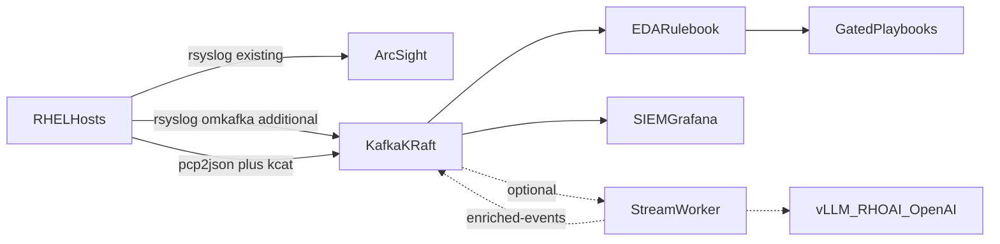

# Comprehensive Deployment Guide

Event-driven **RHEL syslog analysis** automated with **Ansible EDA**, plus optional predictive analytics, on **Red Hat Enterprise Linux** and **Red Hat OpenShift**.

This book is written for platform and automation administrators. Each chapter is a procedure: verify prerequisites, apply the artifacts in this repository, then prove the pipeline with the validation runbook.

## How to use this guide

1. Read [Architecture](01-architecture.md) so topic names, listeners, and consumer groups stay consistent.
2. Complete the [prerequisites checklist](02-prerequisites.md) before changing production hosts or the cluster.
3. Apply Kafka and RHEL telemetry, then [Event-Driven Ansible](05-event-driven-ansible.md) for the ten syslog events.
4. Skip [optional predictive analytics](06-optional-predictive-ai-worker.md) unless you need PCP time-to-exhaustion.
5. Run [validation](07-validation-runbook.md) before enabling remediation safety gates.

Browse the markdown in Git, or serve the site:

```bash
pip install mkdocs-material
mkdocs serve
```

## Component topology



## Chapter map

| Chapter | What you deploy | Artifacts |
| --- | --- | --- |
| [1. Architecture](01-architecture.md) | Contracts and data flow | — |
| [2. Prerequisites](02-prerequisites.md) | Versions, network, security | — |
| [3. Kafka on OpenShift](03-kafka-openshift.md) | Streams for Apache Kafka, KRaft, topics | [openshift/kafka/](../openshift/kafka/) |
| [4. RHEL telemetry](04-rhel-telemetry.md) | rsyslog omkafka **in addition to** ArcSight, PCP | [ansible/telemetry/](../ansible/telemetry/) |
| [5. Event-Driven Ansible](05-event-driven-ansible.md) | Ten syslog rules and gated remediations | [ansible/eda/](../ansible/eda/) |
| [6. Optional predictive worker](06-optional-predictive-ai-worker.md) | Stream worker and inference client | [worker/](../worker/), [openshift/worker/](../openshift/worker/) |
| [7. Validation](07-validation-runbook.md) | Synthetic tests and CLI checks | [scripts/](../scripts/) |
| [8. SIEM and dashboards](08-siem-dashboards.md) | Parallel consumers and Grafana | [siem/](../siem/), [grafana/](../grafana/) |

## Shared identifiers

Copy this table into your runbook. Changing a name requires updating every consumer.

| Object | Value |
| --- | --- |
| Namespace | `logstream-kafka` |
| Kafka cluster | `telemetry` |
| Internal bootstrap | `telemetry-kafka-plain-bootstrap.logstream-kafka.svc:9092` |
| External listener | `tls-external` (OpenShift Route, TLS, client port 443) |
| Topics | `rhel-system-logs` (7d), `rhel-pcp-metrics` (3d), `raw-metrics` (1d), `enriched-events` (3d) |
| Consumer groups | `stream-worker` (optional worker), `ansible-eda`, `siem-logstash`, `siem-splunk` |
| Optional alert type | `PREEMPTIVE_STORAGE_EXHAUSTION_RISK` |
