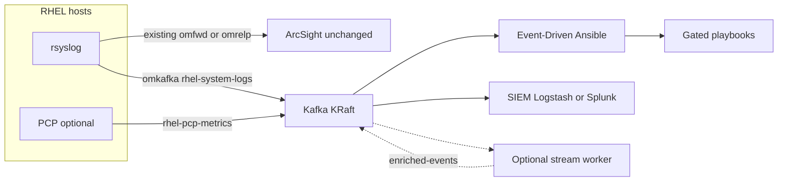

# Introduction

Ship RHEL system logs into Kafka on OpenShift, keep your existing ArcSight path, and automate responses with Event-Driven Ansible — without guessing at remediations.

This book is an **administrator pack**: procedures plus the OpenShift manifests, Ansible roles, rulebooks, playbooks, and validation scripts in this repository. Apply them to an OpenShift cluster and RHEL estate you already operate. It does **not** create a cluster for you.

## What this guide solves

Many RHEL fleets already forward syslog to ArcSight (or similar SIEM tooling). You often also want those same events in Kafka so automation and analytics can react in parallel — without ripping out ArcSight, or turning every noisy log line into a destructive playbook.

This pack gives you:

1. **Dual-home rsyslog** — add Kafka (`omkafka`) while ArcSight `omfwd` / `omrelp` stays untouched.
2. **KRaft Kafka on OpenShift** — Streams for Apache Kafka topics and listeners for producers and consumers.
3. **Event-Driven Ansible on ten high-value syslog patterns** — OOM, SSH brute force, sudo failures, SELinux AVCs, systemd failures, disk I/O errors, account changes, kernel panic / MCE, link down, and package installs.
4. **Fail-closed remediations** — by default playbooks diagnose or notify; firewall bans, restarts, IPMI, and similar actions stay off until you opt in.
5. **Optional predictive disk alerts** — a stream worker that computes time-to-exhaustion from PCP metrics and can call an OpenAI-compatible LLM. Skip that chapter if you only need log-driven EDA.

## Who should use this

Platform, logging, and automation administrators who operate:

- OpenShift **4.20–4.21**
- RHEL **8.10 / 9** endpoints
- Ansible Automation Platform **2.6** Event-Driven Ansible (or **2.5** only on OCP 4.20), **or** `ansible-rulebook` on a jump host

You should be comfortable applying Operator manifests, running Ansible against RHEL, and validating with `oc`, `kcat`, and `logger`. For optional Quarkus worker development, follow [chapter 6 §6.2](06-optional-predictive-ai-worker.md#62-local-development-quarkus-dev-mode): workstation deps for **macOS / Fedora / RHEL**, `mise` + **Podman** (not Docker Desktop), first-run `mise run dev`, and inject-script expected output.

## How the pipeline fits together



Consumer groups are exclusive. Sharing `ansible-eda` with SIEM or the worker steals partitions and drops events.

## Safety model

Destructive actions are **off by default**. Extra vars such as `allow_firewall_ban`, `allow_service_restart`, `allow_ipmi_reboot`, `allow_lb_isolate`, `allow_podman_prune`, and `allow_lvextend` must be set explicitly. Restart the EDA activation or CLI process after changing them.

Open gates only in a change window, on a limited inventory, after [validation](07-validation-runbook.md) passes.

## Runtime choices

There is no single prescribed stack beyond Kafka, dual-home syslog, and EDA:

- **EDA:** AAP Event-Driven Ansible activations, or `ansible-rulebook` CLI — same playbooks, different control plane ([Event-Driven Ansible](05-event-driven-ansible.md)).
- **Inference (optional):** none, vLLM, OpenShift AI, or an external OpenAI-compatible API ([Optional predictive worker](06-optional-predictive-ai-worker.md)).

## Default names

Changing a name means updating every producer and consumer that uses it. Copy this table into your runbook.

| Object | Value |
| --- | --- |
| Namespace | `logstream-kafka` |
| Kafka cluster | `telemetry` |
| Internal bootstrap | `telemetry-kafka-plain-bootstrap.logstream-kafka.svc:9092` |
| External listener | Route TLS `tls-external` (clients use port **443**) |
| Topics | `rhel-system-logs` (7d), `rhel-pcp-metrics` (3d), `raw-metrics` (1d), `enriched-events` (3d) |
| EDA group | `ansible-eda` |
| SIEM groups | `siem-logstash`, `siem-splunk` |
| Worker group | `stream-worker` (only if the optional worker is deployed) |
| Optional alert type | `PREEMPTIVE_STORAGE_EXHAUSTION_RISK` |

## What’s in the repository

| Path | Purpose |
| --- | --- |
| [`openshift/kafka/`](../openshift/kafka/) | Namespace, Streams operator, KRaft node pools, Kafka cluster, topics |
| [`ansible/telemetry/`](../ansible/telemetry/) | Role that adds `omkafka` + PCP exporters; never replaces ArcSight drop-ins |
| [`ansible/eda/`](../ansible/eda/) | Rulebooks, gated playbooks, EE definition, example inventory and extra vars |
| [`extensions/eda/rulebooks/`](../extensions/eda/rulebooks/) | AAP-scanned copies of the AAP rulebooks |
| [`worker/`](../worker/) + [`openshift/worker/`](../openshift/worker/) | Optional Quarkus predictive stream worker (ImageStream + BuildConfig) |
| [`scripts/`](../scripts/) | Synthetic OOM inject, storage-fill test, pipeline checks |
| [`siem/`](../siem/) + [`grafana/`](../grafana/) | Parallel SIEM consumers and Grafana dashboards |

## How to use this book

1. Read [Architecture](01-architecture.md) so topic names, listeners, and consumer groups stay consistent.
2. Complete [Prerequisites](02-prerequisites.md) before changing production hosts or the cluster.
3. Deploy [Kafka](03-kafka-openshift.md) and [RHEL telemetry](04-rhel-telemetry.md), then [Event-Driven Ansible](05-event-driven-ansible.md) for the ten syslog events.
4. Skip the [optional predictive worker](06-optional-predictive-ai-worker.md) unless you need PCP time-to-exhaustion.
5. Run [Validation](07-validation-runbook.md) before enabling remediation safety gates, then wire [SIEM and dashboards](08-siem-dashboards.md) if required.

Preview locally:

```bash
pip install -r docs/requirements-docs.txt
mkdocs serve
```

## Chapter map

| Chapter | What you deploy | Artifacts |
| --- | --- | --- |
| [1. Architecture](01-architecture.md) | Contracts and data flow | — |
| [2. Prerequisites](02-prerequisites.md) | Versions, network, security | — |
| [3. Kafka on OpenShift](03-kafka-openshift.md) | Streams for Apache Kafka, KRaft, topics | [`openshift/kafka/`](../openshift/kafka/) |
| [4. RHEL telemetry](04-rhel-telemetry.md) | rsyslog omkafka **in addition to** ArcSight, PCP | [`ansible/telemetry/`](../ansible/telemetry/) |
| [5. Event-Driven Ansible](05-event-driven-ansible.md) | Ten syslog rules and gated remediations | [`ansible/eda/`](../ansible/eda/) |
| [6. Optional predictive worker](06-optional-predictive-ai-worker.md) | Stream worker and inference client | [`worker/`](../worker/), [`openshift/worker/`](../openshift/worker/) |
| [7. Validation](07-validation-runbook.md) | Synthetic tests and CLI checks | [`scripts/`](../scripts/) |
| [8. SIEM and dashboards](08-siem-dashboards.md) | Parallel consumers and Grafana | [`siem/`](../siem/), [`grafana/`](../grafana/) |

## Next

Continue with [Architecture](01-architecture.md).
