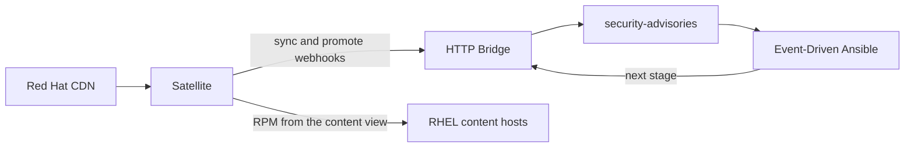

# Automated Remediation

Satellite syncs errata from the Red Hat CDN. RHEL hosts have no internet and are not registered to the Hybrid Cloud Console. They stay registered to Satellite or a Capsule, pinned to a content view and a lifecycle environment. This chapter turns a successful repository sync into a content-view change, then into a scheduled install after two human decisions: an operator promotes the version, and a change ticket is approved.

Event-Driven Ansible does not read a job result and invent the next event. Each job that finds work POSTs the next `stage` to the Streams for Apache Kafka HTTP Bridge. A rule matches that stage and starts the next job. Empty results publish nothing.

The topic is `security-advisories`. It is optional. The [Kafka chapter](../deployment/kafka-openshift.md) does not deploy it, and it is not one of `rhel-system-logs`, `rhel-pcp-metrics`, `raw-metrics`, or `enriched-events`. The consumer group is `ansible-eda-advisories`.



## Stages

| `stage` | Who publishes it | Job | Stops when |
| --- | --- | --- | --- |
| `repository_sync` | Satellite webhook `actions.katello.repository.sync_succeeded` | Look up errata the sync added | — |
| `errata_added` | That lookup | List content hosts where those errata are applicable | No matching errata |
| `hosts_affected` | That host lookup | Incremental-update the content views those hosts already use | No host outside Library |
| `content_view_ready` | The update job, after the Foreman task succeeds | Open a promote ticket | Errata already sit in a version waiting for promotion |
| `content_view_promoted` | Satellite webhook `actions.katello.content_view.promote_succeeded` | Open or update the change ticket | — |
| `change_approved` | The change system | Schedule `katello_errata_install` at a start time | `allow_errata_schedule` is false, or the start time is empty |

```mermaid
flowchart LR
  sync[repository.sync_succeeded]
  errata[Lookup new errata]
  hostsJob[Lookup affected hosts]
  cv[Incremental-update content views]
  ticket[Open promote ticket]
  promote[content_view.promote_succeeded]
  change[Change approved]
  install[Schedule katello_errata_install]
  sync --> errata
  errata -->|"stage errata_added"| hostsJob
  hostsJob -->|"stage hosts_affected"| cv
  cv -->|"stage content_view_ready"| ticket
  ticket --> promote
  promote --> change
  change --> install
```



A sync webhook means the sync task finished, including a sync that added no errata. The first job asks Katello what changed. **Applicable** means the package is installed and the erratum is in Library. **Installable** means the erratum is in the host's content view version and lifecycle environment. Only installable errata can be applied with `katello_errata_install`. Promotion is what makes them installable. Promotion does not open a change window.

Library consumers and hosts on the Default Organization View do not promote. The host lookup records them and leaves them out of `hosts_affected`.

Hammer 6.18 can subscribe to publish and promote. It has no incremental-update event. The update job waits for the Foreman task, then publishes `content_view_ready`.

`actions.remote_execution.run_host_job_katello_errata_install_succeeded` is audit only. Do not add a rule for it. A second install must not be scheduled from that webhook.

Hosts pull RPMs from Satellite or a Capsule. This chain does not run `dnf update` on the host.

## Deploy the topic, Bridge, and Route

Apply this after the `telemetry` Kafka cluster is `Ready`. Streams for Apache Kafka 3.2 provides the `KafkaBridge` custom resource. Manifests:

- [openshift/kafka/kafka-topic-security-advisories.yaml](../../openshift/kafka/kafka-topic-security-advisories.yaml) — 3 partitions, 3 replicas, 7-day retention, `min.insync.replicas` 2
- [openshift/kafka/kafka-bridge.yaml](../../openshift/kafka/kafka-bridge.yaml) — `telemetry-bridge`, bootstrap `telemetry-kafka-plain-bootstrap.logstream-kafka.svc:9092`, HTTP port 8080, one replica
- [openshift/kafka/kafka-bridge-route.yaml](../../openshift/kafka/kafka-bridge-route.yaml) — edge Route, path `/topics`

```bash
oc apply -f openshift/kafka/kafka-topic-security-advisories.yaml \
  -f openshift/kafka/kafka-bridge.yaml \
  -f openshift/kafka/kafka-bridge-route.yaml
oc wait kafkabridge/telemetry-bridge -n logstream-kafka --for=condition=Ready --timeout=300s
oc get route telemetry-bridge -n logstream-kafka -o jsonpath='{.spec.host}{"\n"}'
```

The Route hostname is the webhook target. The path on the Route is `/topics`, so the produce URL is:

```text
https://<route-host>/topics/security-advisories
```

`POST /topics/{topicname}` is the Bridge produce API ([HTTP Bridge API](https://docs.redhat.com/en/documentation/red_hat_streams_for_apache_kafka/3.2/html/using_the_streams_for_apache_kafka_http_bridge/api_reference-bridge)). The body is `{"records":[{"value": ...}]}`. The `Content-Type` is `application/vnd.kafka.json.v2+json`. A raw `application/json` body is rejected. Success is HTTP 200 with `Content-Type: application/vnd.kafka.v2+json`.

The Bridge does not check a webhook secret. The Route is the trust boundary. Termination is edge, so Satellite must trust the OpenShift ingress CA. That is a different certificate from the Kafka cluster CA used by the passthrough broker Route.

The Bridge process also serves a consumer API under `/consumers`. This Route's path does not match `/consumers`. Do not create a second Route without `spec.path: /topics`, and do not expose the Bridge Service outside `logstream-kafka`.

Playbooks that publish the next stage use the same Route. Set `kafka_bridge_url` to the origin only (`https://<route-host>`), with no path. Event-Driven Ansible still consumes with `ansible.eda.kafka` on the broker (`kafka_host` and `kafka_port`), not on port 8080.

## Prove a produce

From a host that trusts the ingress CA:

```bash
curl -sS -D - -o /tmp/bridge-produce.json \
  -H "Content-Type: application/vnd.kafka.json.v2+json" \
  -d '{"records":[{"value":{"stage":"repository_sync","event_name":"curl-proof","task_id":"00000000-0000-0000-0000-000000000000","task_input":{"repository_id":1}}}]}' \
  "https://<route-host>/topics/security-advisories"
```

Expect HTTP 200. Then read the topic with a consumer group that is neither `ansible-eda-advisories` nor `ansible-eda`. From a pod that can see the internal bootstrap, using the `kcat` pattern in [Kafka on OpenShift](../deployment/kafka-openshift.md):

```bash
kcat -b telemetry-kafka-plain-bootstrap.logstream-kafka.svc:9092 \
  -t security-advisories -C -o beginning -e -G verify-pipeline
```

The record value is the object that was inside `value`, including `"stage":"repository_sync"`. The `records` wrapper is not stored.

## Satellite webhooks

Create two webhooks. Templates live in [satellite/](../../satellite/). This pack does not install Satellite.

In the Satellite web UI:

1. **Administer** → **Webhook Templates** → **Create Template**.
2. Name `Repository sync Kafka envelope`. Paste [satellite/webhook-repository-sync.json.erb](../../satellite/webhook-repository-sync.json.erb).
3. Create a second template, `Content view promote Kafka envelope`, from [satellite/webhook-content-view-promote.json.erb](../../satellite/webhook-content-view-promote.json.erb).
4. **Administer** → **Webhooks** → **Create Webhook**.
5. Name `Repository sync to Kafka`. Event `actions.katello.repository.sync_succeeded` (Hammer lists this event; the Administering guide table omits it). Target URL `https://<route-host>/topics/security-advisories`. HTTP method POST. Content type `application/vnd.kafka.json.v2+json`. Template `Repository sync Kafka envelope`. Enable the webhook. Enable SSL verification.
6. Create `Content view promote to Kafka` the same way for `actions.katello.content_view.promote_succeeded` and the promote template.

`@object` in the template is the Foreman task. The JSON value includes `stage`, `task_id`, and `task_input`.

Hammer equivalent, run from the repository root. Confirm the flags on Satellite 6.18 with `hammer template create --help` and `hammer webhook create --help` before you rely on a copied line.

```bash
hammer template create \
  --name "Repository sync Kafka envelope" \
  --type webhook \
  --file satellite/webhook-repository-sync.json.erb

hammer template create \
  --name "Content view promote Kafka envelope" \
  --type webhook \
  --file satellite/webhook-content-view-promote.json.erb

hammer webhook create \
  --name "Repository sync to Kafka" \
  --target-url "https://<route-host>/topics/security-advisories" \
  --http-method POST \
  --http-content-type "application/vnd.kafka.json.v2+json" \
  --event "actions.katello.repository.sync_succeeded" \
  --webhook-template "Repository sync Kafka envelope" \
  --enabled true

hammer webhook create \
  --name "Content view promote to Kafka" \
  --target-url "https://<route-host>/topics/security-advisories" \
  --http-method POST \
  --http-content-type "application/vnd.kafka.json.v2+json" \
  --event "actions.katello.content_view.promote_succeeded" \
  --webhook-template "Content view promote Kafka envelope" \
  --enabled true
```

Sync one repository that Satellite already subscribes to. Consume `security-advisories` again with group `verify-pipeline`. The new record's `stage` is `repository_sync`, and `task_input` contains the repository id the sync task recorded.

Start the Event-Driven Ansible process **before** the sync you want automated. The rulebook offset defaults to `latest`, so a record produced earlier is left for `verify-pipeline` and is not replayed into the job chain.

## Event-Driven Ansible

Run this rulebook in its own process. `group_id` is `ansible-eda-advisories`. The rulebook reads `advisory_kafka_group_id` and does not read `kafka_group_id`, so the syslog vars file cannot attach this consumer to `ansible-eda`.

The ruleset `hosts` pattern is `rhel_telemetry`, the same inventory group as the syslog rulebook. That pattern only keeps the rulebook active. Every playbook in this chain is `hosts: localhost` and calls the Satellite API from the controller.

| Stage | CLI playbook | AAP job template |
| --- | --- | --- |
| `repository_sync` | `playbooks/lookup_sync_errata.yml` | `lookup-sync-errata` |
| `errata_added` | `playbooks/lookup_affected_hosts.yml` | `lookup-affected-hosts` |
| `hosts_affected` | `playbooks/incremental_update_content_views.yml` | `incremental-update-content-views` |
| `content_view_ready` | `playbooks/open_promote_ticket.yml` | `open-promote-ticket` |
| `content_view_promoted` | `playbooks/open_change_ticket.yml` | `open-change-ticket` |
| `change_approved` | `playbooks/schedule_errata_install.yml` | `schedule-errata-install` |

CLI uses [ansible/eda/rulebook-optional-advisories.yml](../../ansible/eda/rulebook-optional-advisories.yml) (`run_playbook`). AAP uses [ansible/eda/aap-rulebook-optional-advisories.yml](../../ansible/eda/aap-rulebook-optional-advisories.yml) (`run_job_template`). The AAP project sync also sees [extensions/eda/rulebooks/aap-rulebook-optional-advisories.yml](../../extensions/eda/rulebooks/aap-rulebook-optional-advisories.yml). Create the six job templates on playbooks under `ansible/eda/playbooks/`, names as in the table. Point them at an inventory that can run on the controller. Keep `allow_errata_schedule` false on the templates.

Copy [ansible/eda/vars/satellite_remediation.example.yml](../../ansible/eda/vars/satellite_remediation.example.yml) to a mode `0600` file and replace the token placeholder. `satellite_token` is a Satellite personal access token used as the HTTP basic password. There is no real credential in the example.

```bash
cd ansible/eda
cp vars/satellite_remediation.example.yml vars/satellite_remediation.yml
# edit the URL, username, token, and kafka_bridge_url

ansible-rulebook \
  --rulebook rulebook-optional-advisories.yml \
  --inventory inventory/hosts.yml \
  --vars vars/satellite_remediation.yml \
  --verbose
```

On AAP, create an activation from the advisory rulebook, the same decision environment as the syslog activation, and these variables. Restart the activation after a project sync. Do not add this rulebook to the syslog activation.

Rules throttle for one minute, grouped by `task_id` or `dedupe_key`, so a webhook retry does not start a second job immediately. A later event with a new id still runs.

## What each job does

**Errata added.** [lookup_sync_errata.yml](../../ansible/eda/playbooks/lookup_sync_errata.yml) reads `repository_id` from the task input and `started_at` from the Foreman task. It searches that repository for `satellite_errata_types` (default `type = security`) and keeps errata whose `updated` or `issued` calendar day is on or after the sync start day. The search is paged. More than 5000 matches fails the job so a short page is never published as a complete result. One RHSA synced into several repositories becomes several `errata_added` events. If those errata are already in the newest Library version, the content-view job does not create another version. No date match publishes nothing.

**Hosts affected.** [lookup_affected_hosts.yml](../../ansible/eda/playbooks/lookup_affected_hosts.yml) searches `applicable_errata = "<errata_id>"` and pages the result. A search with more than 2000 hosts fails the job. A host is published only when it has a content view and a lifecycle environment other than Library, and the view is not Default Organization View. The API fields used are `content_facet_attributes` or top-level `content_view_id`, `content_view_name`, `lifecycle_environment_id`, and `lifecycle_environment_name`. Hosts that stay in Library are listed in the job log and omitted from `hosts_affected`.

**Content view ready.** [incremental_update_content_views.yml](../../ansible/eda/playbooks/incremental_update_content_views.yml) groups those hosts by content view. For each view it takes the newest Library version. If every requested erratum is already in that version, it publishes nothing for that view: the version is either waiting for promotion or already in the host environment. Otherwise it POSTs `/katello/api/content_view_versions/incremental_update` with the missing erratum ids and `resolve_dependencies: true`. The body has no lifecycle environment ids, so Satellite creates a new Library version and does not promote it. The job polls the Foreman task (default 120 times, 15 seconds apart) and publishes `content_view_ready` only when the task result is `success` and a newer Library version exists. The first failed content view stops the play, so a ticket is not opened for a partial run. Versions created before that failure remain in Satellite for an operator to inspect.

**Promote ticket.** [open_promote_ticket.yml](../../ansible/eda/playbooks/open_promote_ticket.yml) records the versions, errata, hosts, and a `change_approved` body the change system can send later. When `promote_ticket_url` is set, it POSTs that JSON. It never calls the promote API. An operator promotes the version into the host lifecycle environment in Satellite. Satellite then emits `content_view_promoted`.

**Change ticket.** [open_change_ticket.yml](../../ansible/eda/playbooks/open_change_ticket.yml) reads the promote task for the content view, version, and environment, lists content hosts in that environment, and records the change ticket. Errata on that ticket are copied from the promote ticket, which is the list the chain selected. The job does not call `katello_errata_install`. When `change_ticket_url` is set, it POSTs the payload.

**Change approved.** The change system must POST `stage` `change_approved` itself. Satellite does not emit that event. Use the Bridge envelope. [satellite/change-approved.example.json](../../satellite/change-approved.example.json) is the body: `ticket_id` or `dedupe_key`, the approved `errata` and `hosts`, and `errata_schedule_start` in a form Foreman accepts (for example `2026-10-09T02:00:00Z`).

[schedule_errata_install.yml](../../ansible/eda/playbooks/schedule_errata_install.yml) schedules the install only when `allow_errata_schedule` is true **and** `errata_schedule_start` is set. Otherwise it records the request and exits. The call is `POST /api/job_invocations` with feature `katello_errata_install`, the erratum ids, a host search, and `scheduling.start_at`. Leave the flag false until the activation is reviewed. A message on the topic is not enough to install packages.

## Paths this procedure does not use

Satellite inventory upload can report hosts to Lightspeed in the Hybrid Cloud Console without giving those hosts internet. This chain does not require Lightspeed, `insights-client`, or a vulnerability webhook.

A Satellite that also cannot reach the CDN gets advisories by Inter-Satellite Sync export and import. That is a different estate.

The Satellite MCP server (`foreman-mcp-server`) is an interactive Technology Preview. This chapter does not deploy it, and it does not grant that server `katello_errata_install`.

## Checklist

- [ ] Topic `security-advisories`, Bridge `telemetry-bridge`, and the `/topics` Route are Ready.
- [ ] A curl produce returns HTTP 200, and `verify-pipeline` can read the value.
- [ ] Both webhooks use `application/vnd.kafka.json.v2+json` and the records envelope.
- [ ] Satellite trusts the ingress CA. SSL verification on the webhook is on.
- [ ] The advisory rulebook runs alone, with group `ansible-eda-advisories`.
- [ ] `satellite_token` is a personal access token in a mode `0600` vars file, not the example placeholder.
- [ ] `allow_errata_schedule` is false until a reviewed activation should schedule installs.
- [ ] The change system POSTs `change_approved` with the errata, hosts, and start time from the approved ticket.
- [ ] No rule is subscribed to `katello_errata_install_succeeded`.
