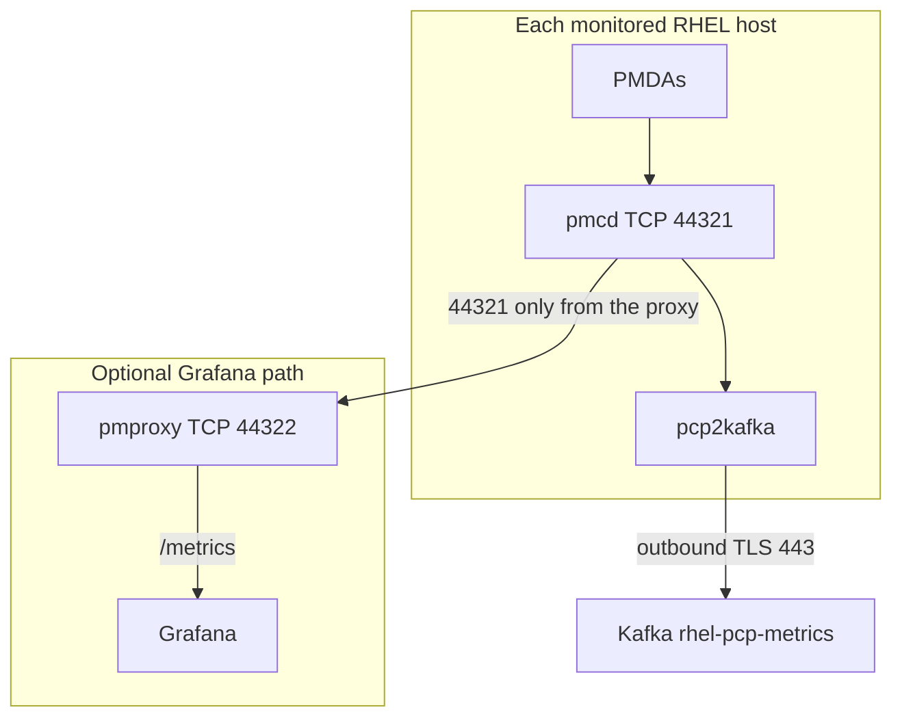

# Metrics Dashboard using PCP

This chapter is how you graph the same host metrics the pack already collects. Kafka cluster `telemetry` in namespace `logstream-kafka` stays the system of record for the event stream. Grafana does not join a Kafka consumer group.

Event-Driven Ansible keeps the exclusive group `ansible-eda`. If you deploy the optional predictive worker, it uses `stream-worker` exclusively. Pipeline checks are in [Validation](../validation/runbook.md). Host collection is in [RHEL telemetry](../deployment/rhel-telemetry.md).

Background for the toolkit: the [PCP introduction](https://pcp.io/docs/pcpintro.html) and [Setting up PCP](https://docs.redhat.com/en/documentation/red_hat_enterprise_linux/9/html/monitoring_and_managing_system_status_and_performance/setting-up-pcp_monitoring-and-managing-system-status-and-performance) on RHEL 9. This book targets RHEL 8.10 and 9. The same roles are documented for RHEL 10.

## What Performance Co-Pilot does

Performance Co-Pilot (PCP) collects, stores, and analyzes system performance measurements. Collection is distributed: a client can run on a different host from the one being measured.

A **PMDA** (Performance Metrics Domain Agent) reads one domain, such as the kernel, filesystems, or processes. `pmdaproc` is the agent that serves the hot-process metrics this pack exports (`hotproc.psinfo.rss` and `hotproc.psinfo.cmd`).

**pmcd** (Performance Metrics Collector Daemon) runs on the host being measured. It loads the PMDAs and routes client requests. It listens on TCP **44321**. `pminfo`, `pmstat`, and this pack’s `pcp2json` are pmcd clients. `pmlogger` writes archives you can replay later. This guide does not deploy `pmlogger` or `pmie`.

**pmproxy** is an HTTP front end. It exposes a live REST API under `/pmapi` and a Prometheus `/metrics` endpoint, on TCP **44322** by default. It does not collect metrics. Grafana and the `grafana-pcp` plugin talk to pmproxy. A common multi-host layout is one pmproxy (and optionally Valkey or Redis) in front of many pmcd instances. The other layout is pmproxy beside a local pmcd when you scrape that host directly.

## How this pack uses them

Every monitored host runs **pmcd**. Onboarding starts it, and `pcp2kafka` (`pcp2json` piped to `kcat`) pushes samples to `rhel-pcp-metrics` over outbound TCP 443. That path does not use pmproxy.

**pmproxy is not required on every host.** The telemetry role never starts it. `pcp_expose_remote` stays false unless a remote client must connect to pmcd.

Use one pmproxy (or a few) when Grafana’s Prometheus datasource should scrape PCP. Point that proxy at each host’s pmcd on 44321, and open 44321 only from the proxy. Run pmproxy on a host only when that host’s own `:44322/metrics` is the scrape target.

The PCP Grafana panels expect Prometheus names such as `pcp_filesys_used_bytes`. Those names come from pmproxy `/metrics`.

## Grafana: import Kafka throughput and lag

This dashboard uses OpenShift / Strimzi Prometheus metrics (broker CPU, consumer lag, PVC bytes). It does not scrape pmproxy.

1. Grafana → **Dashboards** → **Import**.
2. Upload [grafana/kafka-throughput-lag.json](../../grafana/kafka-throughput-lag.json) (UID `logstream-kafka`).
3. Select the Prometheus datasource that scrapes user-workload monitoring or your Strimzi PodMonitor.
4. Confirm variables:
   - `namespace` = `logstream-kafka`
   - `cluster` = `telemetry`
   - `topic` regex includes `rhel-system-logs`, `rhel-pcp-metrics`, `raw-metrics`, `enriched-events`
   - `group` regex includes `ansible-eda` and, if the worker is deployed, `stream-worker`
5. Set time range `now-1h`, refresh `30s`.
6. Generate traffic with [scripts/inject-oom-log.sh](../../scripts/inject-oom-log.sh) if the cluster is idle ([runbook](../validation/runbook.md)).

| Step | Pass | Fail |
|------|------|------|
| G1 | Import succeeds without JSON schema errors | Invalid JSON / wrong Grafana version — use Grafana 9+ / 10 |
| G2 | Active controller = 1; under-replicated = 0 | Controller election or disk issues |
| G3 | Messages/bytes in > 0 on syslog and PCP topics while hosts produce | Wrong datasource or topic labels |
| G4 | Lag panel shows a separate series for `ansible-eda` and, if deployed, `stream-worker` | A second consumer joined one of those groups |
| G5 | After OOM inject, `rhel-system-logs` rate ticks up | omkafka not producing |

## Grafana: import PCP system metrics

1. Import [grafana/pcp-system-metrics.json](../../grafana/pcp-system-metrics.json) (UID `logstream-pcp`).
2. Bind a Prometheus datasource that scrapes pmproxy `/metrics` (one proxy for many hosts, or each host’s `:44322` if you run pmproxy there).
3. If PCP names differ in your scrape (prefix `pcp_` vs raw `filesys_used`), panels use `or` fallbacks; adjust PromQL if your exporter uses another convention.
4. Align with storage-fill: run `create` from [scripts/storage-fill-test.sh](../../scripts/storage-fill-test.sh), confirm filesys used % rises, then **cleanup**.

| Step | Pass | Fail |
|------|------|------|
| M1 | Dashboard loads | Import error |
| M2 | Kafka messages-in for `rhel-pcp-metrics` / `raw-metrics` non-zero | pcp2kafka down (still useful as a pipeline panel) |
| M3 | Filesys used % increases during storage-fill, decreases after `rm` | Wrong instance selector, or Grafana is not scraping pmproxy `/metrics` |

## Related files

| File | Role |
|------|------|
| [grafana/kafka-throughput-lag.json](../../grafana/kafka-throughput-lag.json) | Broker CPU, consumer lag, PVC bytes |
| [grafana/pcp-system-metrics.json](../../grafana/pcp-system-metrics.json) | Host CPU, memory, filesystem from pmproxy |
| [ansible/telemetry/](../../ansible/telemetry) | Starts pmcd and `pcp2kafka`; does not start pmproxy |
