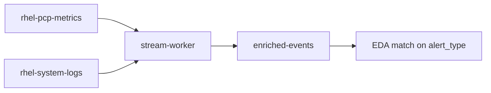

# Optional Predictive Worker

This chapter is **optional**. The core pipeline is syslog on `rhel-system-logs` plus Event-Driven Ansible in [Event-Driven Ansible](../deployment/event-driven-ansible.md). Deploy this worker only if you want PCP/raw-metric time-to-exhaustion (TTE) alerts on `enriched-events`. Skip image build, Secret, and the optional EDA rulebook if you do not need predictive storage alerts.

EDA for TTE uses `ansible/eda/rulebook-optional-predictive.yml` (CLI) or `aap-rulebook-optional-predictive.yml` (AAP). Do not add those sources unless this worker is running. Keep consumer group `stream-worker` exclusive to the worker.

This chapter deploys a **Quarkus** Kafka worker that computes **time-to-exhaustion (TTE)** from PCP / raw metrics and optionally classifies events with an OpenAI-compatible inference API. Quarkus **dev mode** via `mise run dev` (Podman Dev Services) is the supported local development loop — see [Local development (Quarkus dev mode)](#local-development-quarkus-dev-mode).

Source: [`worker/`](../../worker). Manifests: [`openshift/worker/`](../../openshift/worker) (includes ImageStream + BuildConfig for continuous builds).

There is **no single default inference backend**. Choose a row in the decision matrix, or run with inference disabled and still emit predictive metric alerts.

## What the worker does

| Direction | Name | Notes |
| --- | --- | --- |
| Namespace | `logstream-kafka` | Same project as Kafka |
| Kafka cluster | `telemetry` | Internal plaintext listener |
| Bootstrap | `telemetry-kafka-plain-bootstrap.logstream-kafka.svc:9092` | In-cluster **plaintext** |
| Consume | `rhel-pcp-metrics` and/or `raw-metrics` | `KAFKA_CONSUME_TOPICS` (default: both) |
| Produce | `enriched-events` | JSON keyed by host |
| Consumer group | `stream-worker` | Do not reuse this group for EDA |
| Runtime | Quarkus 3 / OpenJDK 21 | SmallRye Reactive Messaging + REST Client |

**TTE formula** (rolling window; `dUsed/dt` is a least-squares slope):

```
TTE = (Capacity - Used_current) / (dUsed/dt)
```

- If the fill rate is **less than or equal to zero** (flat or shrinking usage), the worker **does not** emit an exhaustion alert.
- If TTE is at or below `TTE_ALERT_THRESHOLD_SECONDS`, it produces an event whose `alert_type` and `type` are exactly:

```
PREEMPTIVE_STORAGE_EXHAUSTION_RISK
```

The optional EDA rulebook matches that string. Do not rename it.

If `INFERENCE_BASE_URL` is unset (omit the env var; do not set it to `""`), log RCA / severity scoring is skipped. Metric alerts still go to `enriched-events`.

Implementation lives under `worker/src/main/java/ai/logstream/worker/` (`predict`, `process`, `parse`, `infer`, `messaging`).

### Further preemptive patterns

Filesystem-byte TTE is the only detector this worker implements. The four patterns below use the same shape: a positive slope (or a rising hardware-error rate) on one stream, a second signal on the same host, then one stable `alert_type` on `enriched-events`. Event-Driven Ansible matches that string and runs a fail-closed playbook. Inference text stays optional and does not decide the alert.

Correlation belongs in a worker on group `stream-worker`. That consumer may also read `rhel-system-logs` without taking group `ansible-eda`. When the hard-failure string is already in the log, leave the event to the matching rule in [ansible/eda/rulebook.yml](../../ansible/eda/rulebook.yml).



Shared forecast, same as filesystem bytes:

```text
TTE = (Capacity - Used_current) / (ΔUsed / Δt)
```

If the rate is zero or negative (usage is flat or shrinking), do not emit an exhaustion alert.

**Memory pressure before the OOM killer.** The catalog reacts to `Out of memory: Kill process`, which is after a process is already dead. `mem.util.free` and `mem.physmem` are already on `rhel-pcp-metrics`. Forecast:

```text
TTE = mem.util.free / (Δused / Δt)
```

`Δused / Δt` is the slope of `mem.physmem - mem.util.free`. Require a leading log on that host in the same window: `page allocation failure` or systemd `Under memory pressure`. Free memory also falls when the page cache grows; the log is what shows the shortage is not reclaimable cache. Skip the alert when the message already contains `Out of memory: Kill process` (rule “Kernel OOM killer”, [playbooks/remediate_oom.yml](../../ansible/eda/playbooks/remediate_oom.yml)). Alert type: `PREEMPTIVE_MEMORY_EXHAUSTION_RISK`. The playbook collects `ps`, cgroup memory, and the pressure line. Leave `allow_service_restart` and `allow_drop_caches` false. When one process explains the slope, the next pattern names it. This alert stays the host-level signal.

**A process leaking or growing quickly.** The host-level forecast does not name a process. The OOM line names the victim only after the kernel has killed it. Key a rolling window on `(host, pid)` and apply the same slope to that process's resident set, against remaining RAM:

```text
TTE = mem.util.free / (ΔRSS / Δt)
```

`ΔRSS / Δt` is the least-squares slope of resident set. A zero or negative slope does not emit. If `hotproc.psinfo.cmd` for that pid changes, drop the series (the pid was reused).

Two deterministic reasons share one alert type:

- **Leak.** The slope stays positive for the full window (same minimum sample count as filesystem TTE), TTE is inside the horizon, and this process accounts for most of the host's rise in used memory. A cache warmup that flattens loses the positive slope and does not alert.
- **Rapid growth.** RSS gain inside the window is a large share of `mem.physmem` while the slope is still positive. This fires before a long leak fit is ready.

Onboarding already exports the series. The `rhel_telemetry` role writes a hotproc predicate and adds `hotproc.psinfo.rss` and `hotproc.psinfo.cmd` to `pcp_metrics`. Both RSS and `mem.util.free` are kilobytes. See [RHEL telemetry](../deployment/rhel-telemetry.md#pcp-pcp2kafka). The worker does not yet emit this alert. A log line that contains the command name (unit errors, restart loops) can corroborate the host; the slope still decides. Skip when the message is already `Out of memory: Kill process`. Alert type: `PREEMPTIVE_PROCESS_MEMORY_GROWTH`, with `host`, `pid`, `cmd`, `rss`, `rate`, `tte_seconds`, and `reason` of `leak` or `rapid_growth`. The playbook records that process (`ps`, `smaps_rollup`, cgroup) and the slope. Leave `allow_service_restart` false. JVM heaps, database buffer pools, and file caches grow on purpose.

**Storage-path degradation before filesystem corruption.** The catalog reacts to `I/O error`, `EXT4-fs error`, and `XFS: corrupt`, which is after the filesystem is already damaged. This pattern pairs a rate with a hardware log. It has no capacity TTE. Use the rate of `kernel.all.cpu.wait.total` (iowait ticks over the window, already collected). A per-device follow-on is `disk.dev.await`, which the default `pcp_metrics` list does not include. Leading logs on the same host, and the same device when the line has one: `exception Emask`, SCSI `FAILED Result`, `Medium Error` or a pending sector from `smartd`, or `blocked for more than 120 seconds`. Emit when iowait stays above the host baseline for the window and at least one of those lines is present. Skip when the line already matches the reactive filesystem-error rule, so [playbooks/isolate_host_io_error.yml](../../ansible/eda/playbooks/isolate_host_io_error.yml) is not started twice. Alert type: `PREEMPTIVE_STORAGE_PATH_DEGRADATION`. Run that diagnostic playbook so the ticket has evidence. Leave `allow_lb_isolate` false until a person drains the host. When `kernel.all.cpu.user` and `kernel.all.cpu.sys` dominate and wait does not, this alert does not apply.

**One syslog tag filling `/var`.** Byte TTE on `/var` or `/var/log` can already fire `PREEMPTIVE_STORAGE_EXHAUSTION_RISK`. That alert cannot tell Event-Driven Ansible whether to grow the volume or stop the writer. Count messages per `host` and `syslogtag` in the same window. Emit when the byte slope is positive, TTE is inside the horizon, and one tag (a debug-enabled service, a restart loop, journald) accounts for most of the new lines. A single ATA or SMART line stays on the storage-path pattern. When no tag dominates, keep `PREEMPTIVE_STORAGE_EXHAUSTION_RISK` and [playbooks/proactive_disk_mitigation.yml](../../ansible/eda/playbooks/proactive_disk_mitigation.yml). Alert type: `PREEMPTIVE_LOG_FLOOD_RISK`, with `host`, mount, and `syslogtag`. The playbook records `journalctl` for that unit and the size of `/var/log`. Leave `allow_lvextend` and `allow_podman_prune` false for this alert. Growing the disk feeds the flood. A restart or rate-limit stays gated off.

## Local development (Quarkus dev mode)

Use this section on a **developer workstation** before deploying to OpenShift. Kafka Dev Services runs through **Podman only** (not Docker Desktop). Language/tool versions come from [`worker/mise.toml`](../../worker/mise.toml).

### Workstation dependency overview

| Dependency | Required? | Provided by | Used for |
| --- | --- | --- | --- |
| [mise](https://mise.jdx.dev/) | Yes | OS package / install script | Pins Java, Maven, Quarkus CLI, Python, uv |
| Java 21 (**OpenJDK**) | Yes | mise (`openjdk-21.0.2`) | Compile / run Quarkus; matches UBI9 OpenJDK 21 containers |
| Maven 3.9.x | Yes | mise (+ `./mvnw`) | `quarkus:dev`, tests, package |
| Quarkus CLI 3.40.x | Optional | mise | Helpers only; daily work uses `./mvnw` |
| Python 3.12 + uv | Yes (for inject) | mise | Metric inject via `kafka-python` |
| **Podman** | Yes | OS / Podman Desktop | Kafka Dev Services + inject bootstrap discovery |
| bash | Yes | OS | Shell wrappers under `scripts/` |
| curl | Yes (Podman helper) | OS | API ping in [`podman-env.sh`](../../worker/scripts/podman-env.sh) |
| `kcat` | Optional | OS package | Legacy inject fallback; cluster scripts in Validation |
| `oc` | Optional | OpenShift client | Port-forward cluster Kafka instead of Dev Services |

**Not used for Dev Services:** Docker Desktop. Pointing Quarkus at Docker will produce warnings such as `Docker isn't working, please configure the Kafka bootstrap servers property` and Kafka will not start.

Host scripts [`inject-oom-log.sh`](../../scripts/inject-oom-log.sh) and [`storage-fill-test.sh`](../../scripts/storage-fill-test.sh) run on **RHEL endpoints**, not on this workstation (see [Validation](../validation/runbook.md)).

### Install on macOS

1. **Podman** — install [Podman Desktop](https://podman-desktop.io/) (recommended) or `brew install podman`. Create and start a machine:

```bash
podman machine init        # once
podman machine start
podman machine list        # Last Up should include "Currently running"
```

Enable Docker **compatibility** in Podman Desktop if prompted (helps `/var/run/docker.sock` helpers). This project still forces Podman via [`podman-env.sh`](../../worker/scripts/podman-env.sh).

2. **mise** — [install mise](https://mise.jdx.dev/getting-started.html), then activate in your shell (`~/.bashrc` / `~/.zshrc`):

```bash
curl https://mise.run | sh
echo 'eval "$(mise activate zsh)"' >> ~/.zshrc   # or bash
source ~/.zshrc
```

3. **Optional:** `brew install kcat` (only if you skip the mise/uv inject path). **Optional:** install `oc` from the OpenShift mirror if you will port-forward cluster Kafka.

4. Continue at [Install the mise toolchain](#install-the-mise-toolchain).

### Install on Fedora

1. **Podman** (usually already present):

```bash
sudo dnf install -y podman curl
systemctl --user enable --now podman.socket
podman info >/dev/null
```

Rootless socket path is typically `unix:///run/user/$UID/podman/podman.sock`. `mise run dev` sets `DOCKER_HOST` to that socket.

2. **mise:**

```bash
curl https://mise.run | sh
echo 'eval "$(mise activate bash)"' >> ~/.bashrc
source ~/.bashrc
```

Or install from Fedora/Copr if your site prefers packages.

3. **Optional:** `sudo dnf install -y kcat`. **Optional:** `oc` RPM / tarball for cluster port-forward.

4. Continue at [Install the mise toolchain](#install-the-mise-toolchain).

### Install on RHEL

Use a RHEL **8.10 / 9** workstation or jump host with subscription entitlements available for AppStream (and EPEL if you need `kcat`).

1. **Podman:**

```bash
sudo dnf install -y podman curl
systemctl --user enable --now podman.socket
loginctl enable-linger "$(whoami)"   # keep user podman.socket after logout (optional but useful)
podman info >/dev/null
```

On RHEL, prefer the distribution `podman` package — do not install Docker Desktop for this workflow. Quarkus guide: [Using Podman with Quarkus](https://quarkus.io/guides/podman).

2. **mise** (same as Fedora):

```bash
curl https://mise.run | sh
echo 'eval "$(mise activate bash)"' >> ~/.bashrc
source ~/.bashrc
```

3. **Optional `kcat`:** try AppStream first; if missing, enable EPEL per site policy then `sudo dnf install -y kcat`. Do not copy random binaries onto managed hosts.

4. **Optional `oc`:** OpenShift client matching your cluster version.

5. Continue at [Install the mise toolchain](#install-the-mise-toolchain).

### Install the mise toolchain

From the repository clone:

```bash
cd worker
mise trust          # first time only, if mise asks
mise install        # java, maven, quarkus, python, uv from mise.toml
mise ls
java -version       # openjdk 21.0.2 (prefer OpenJDK, not Temurin)
mvn -version        # Apache Maven 3.9.16
quarkus --version   # 3.40.1
python --version    # 3.12.x
uv --version        # 0.12.x
```

Local Java must stay on **OpenJDK 21** so it matches the JVM container line (`registry.access.redhat.com/ubi9/openjdk-21*:1.24`) and the UBI 9 generation of `quay.io/quarkus/ubi9-quarkus-micro-image:2.0` used for native micro builds (that image has no JDK; native binaries are still produced with OpenJDK 21 + Mandrel/GraalVM as configured).

| Task (from `worker/`) | What it does |
| --- | --- |
| `mise run dev` | Source [`podman-env.sh`](../../worker/scripts/podman-env.sh), then `./mvnw quarkus:dev` |
| `mise run test` | Same Podman env, then `./mvnw -B test` |
| `mise run package` | Same Podman env, then `./mvnw -B package` |
| `mise run inject-metrics -- [flags]` | Inject rising PCP samples (`uv` + `kafka-python`) |

[`podman-env.sh`](../../worker/scripts/podman-env.sh) sets `DOCKER_HOST` to the Podman API socket, disables Testcontainers Ryuk, starts `podman machine` on macOS when needed, and puts a `docker`→Podman shim on `PATH` so Quarkus does not talk to Docker Desktop.

Sanity check:

```bash
cd worker
source scripts/podman-env.sh
# Expect a line like: Podman Dev Services env: DOCKER_HOST=unix://… (docker → …/logstream-podman-docker-shim/docker)
docker info >/dev/null
```

### First-time development loop

Do this once toolchain + Podman are installed.

**Terminal A — start Quarkus**

```bash
cd worker
mise run dev
```

**Expected output (success):**

1. `Podman Dev Services env: DOCKER_HOST=unix://…`
2. Maven/`quarkus:dev` starts; debugger line `Listening for transport dt_socket at address: 5005` is normal.
3. Testcontainers connects to Podman (`Connected to docker:` / Server Version from Podman).
4. `Dev Services for Kafka started` and a bootstrap such as `localhost:<ephemeral-port>`.
5. Topics listed: `{raw-metrics=1, enriched-events=1, rhel-pcp-metrics=1}`.
6. Final lines similar to:

```text
worker 1.0.0-SNAPSHOT on JVM (powered by Quarkus 3.40.1) started in …. Listening on: http://0.0.0.0:8080
Profile dev activated. Live Coding activated.
Installed features: [… kafka-client, messaging-kafka, … smallrye-health …]
```

**Health check:**

```bash
curl -s http://127.0.0.1:8080/healthz
# Expect JSON with "status":"UP" (and messaging checks OK)
```

Leave Terminal A running. Hot-reload applies Java changes automatically.

**If startup fails:**

| Symptom | Likely cause | Action |
| --- | --- | --- |
| `Could not find a valid Docker environment` / Podman API `Status 500` + `registries.conf.d/999-podman-desktop…` | Corrupt Podman Desktop registries drop-in inside the machine | See [Podman troubleshooting and external Kafka](#podman-troubleshooting-and-external-kafka) |
| `SRCFG00040` / empty `worker.inference.base-url` | Empty-string config (fixed in current tree; leave `INFERENCE_BASE_URL` unset) | Pull latest worker; do not export `INFERENCE_BASE_URL=` |
| Port `8080` in use | Another process bound | Stop the other process or change `quarkus.http.port` |

**Stop dev mode:** in Terminal A press `q`, or send SIGTERM to the `mise run dev` / `quarkus:dev` process.

### Metric inject scripts (usage and expected output)

With Terminal A still running Dev Services Kafka:

**Terminal B — inject rising filesystem samples**

```bash
# Preferred (from worker/)
cd worker
mise run inject-metrics -- --consume

# Equivalent from repo root
chmod +x scripts/inject-worker-metrics.sh   # once
./scripts/inject-worker-metrics.sh --consume
```

| Script | Role |
| --- | --- |
| [`scripts/inject_worker_metrics.py`](../../scripts/inject_worker_metrics.py) | Produce/consume via `kafka-python` |
| [`scripts/inject-worker-metrics.sh`](../../scripts/inject-worker-metrics.sh) | Wrapper: mise/`uv` first, optional `kcat` fallback |
| `mise run inject-metrics` | Same Python path with Podman env loaded |

**Useful flags** (pass after `--` for the mise task):

| Flag | Default | Meaning |
| --- | --- | --- |
| `-b` / `--bootstrap` | Dev Services discovery | Kafka `host:port` |
| `-n` / `--samples` | `6` | Points to send (≥ `MIN_SAMPLES`, default 4) |
| `-i` / `--interval` | `1` | Seconds between samples |
| `-H` / `--host` | `testhost` | Kafka key / `host` field |
| `-m` / `--mount` | `/var` | Filesystem instance |
| `-c` / `--capacity` | `1000` | Capacity value |
| `--consume` | off | After produce, print recent `enriched-events` |

**Expected inject output:**

```text
Using Quarkus Dev Services Kafka at localhost:<port>
Producing 6 samples to rhel-pcp-metrics @ localhost:<port> (host=testhost mount=/var)
  [0] used=100 capacity=1000 t=…
  [1] used=200 capacity=1000 t=…
  …
  [5] used=600 capacity=1000 t=…
Done. With default MIN_SAMPLES=4 and a positive fill rate, expect an alert on enriched-events.
Watch worker logs for: emitted PREEMPTIVE_STORAGE_EXHAUSTION_RISK
Consuming enriched-events (up to 20 messages from end)...
{"@timestamp":"…","event_type":"PREDICTIVE_ALERT","alert_type":"PREEMPTIVE_STORAGE_EXHAUSTION_RISK","type":"PREEMPTIVE_STORAGE_EXHAUSTION_RISK","host":"testhost","instance":"/var",…,"tte_seconds":…,"used":…,"capacity":1000.0,…}
```

**Expected worker log (Terminal A):** a line mentioning emission of `PREEMPTIVE_STORAGE_EXHAUSTION_RISK` for `testhost` / `/var`.

**Pass criteria:**

| Check | Pass |
| --- | --- |
| Bootstrap discovery | Script prints `Using Quarkus Dev Services Kafka at localhost:…` without requiring `-b` |
| Produce | Six `[n] used=…` lines; no connection errors |
| Alert | JSON on stdout (with `--consume`) and/or worker log contains `PREEMPTIVE_STORAGE_EXHAUSTION_RISK` |
| Identity | `alert_type` and `type` are exactly `PREEMPTIVE_STORAGE_EXHAUSTION_RISK`; `host` matches `-H` |

**Fail / empty consume:** usually Dev Services not up yet, wrong bootstrap, fewer than `MIN_SAMPLES` with positive slope, or alert still in cooldown (`ALERT_COOLDOWN_SECONDS`). Re-run with `-n 8` or wait for cooldown.

Unit tests (separate from inject):

```bash
cd worker && mise run test
```

Expect Maven `BUILD SUCCESS`. Package: `mise run package` (or `./mvnw -B package -DskipTests` to skip tests).

### Pointing at cluster Kafka (optional)

Exporting `KAFKA_BOOTSTRAP_SERVERS` **disables** Dev Services. Example with OpenShift port-forward:

```bash
oc -n logstream-kafka port-forward svc/telemetry-kafka-plain-bootstrap 9092:9092
export KAFKA_BOOTSTRAP_SERVERS=localhost:9092
cd worker && mise run dev
# inject with explicit bootstrap:
mise run inject-metrics -- --consume -b localhost:9092
```

### Podman troubleshooting and external Kafka

**Corrupt registries drop-in (macOS / Podman Desktop):** Testcontainers fails with `Status 500` / `toml: … key name appears blank` mentioning `/etc/containers/registries.conf.d/999-podman-desktop-registries-from-host.conf`. Fix inside the VM:

```bash
podman machine ssh -- sudo tee /etc/containers/registries.conf.d/999-podman-desktop-registries-from-host.conf <<'EOF'
[[registry]]
location = "quay.io"
insecure = false
EOF
```

Then retry `mise run dev`. Until the file is valid, the Podman API returns 500 on `/info` and Kafka Dev Services cannot start.

**Running Maven without mise tasks:**

```bash
cd worker
source scripts/podman-env.sh
./mvnw quarkus:dev
```

### Local inference testing with Ollama

Use this procedure on a **developer workstation** to exercise LLM enrichment against Kafka Dev Services without a cluster inference backend. The worker calls Ollama’s OpenAI-compatible API at `http://127.0.0.1:11434/v1`. Prefer **IBM Granite** models in the **16–24 GB** RAM class; the tested default is **`granite3.3:2b`** (~1.5 GB on disk).

Prerequisites: [Workstation dependency overview](#workstation-dependency-overview) (mise + Podman + `mise run dev` already known to work without inference). Install the [Ollama](https://ollama.com/) CLI (macOS: `brew install ollama` or the desktop app; Fedora/RHEL: follow Ollama’s Linux install).

#### Step 1 — Start Ollama

```bash
# If the API is not already up:
ollama serve
# Verify:
curl -sf http://127.0.0.1:11434/api/version
```

Leave this process running (or use the Ollama app, which serves the same port).

#### Step 2 — Pull the recommended model

```bash
ollama pull granite3.3:2b
ollama list   # expect granite3.3:2b
```

Optional alternatives that also passed the worker JSON bench: `granite3.1-moe:3b`, `granite4:3b`, `granite3.3:8b`. Avoid `granite4.2:*` and `qwen3:*` with the current client (they often leave OpenAI `message.content` empty). Full score/latency table: [Model evaluation results](#model-evaluation-results). Raw JSON: [`docs/ollama-model-bench.json`](../ollama-model-bench.json). Re-bench with:

```bash
python3 scripts/bench_ollama_inference.py granite3.3:2b
```

#### Step 3 — Start Quarkus with inference env

In a **second** terminal (Podman ready; do not set `KAFKA_BOOTSTRAP_SERVERS` if you want Dev Services):

```bash
cd worker
export INFERENCE_BASE_URL=http://127.0.0.1:11434/v1
export INFERENCE_MODEL=granite3.3:2b
export LLM_ON_METRIC_ALERTS=true
export INFERENCE_TIMEOUT_SECONDS=60
# Leave INFERENCE_API_KEY unset — Ollama does not require a bearer token
mise run dev
```

Wait until logs show `Listening on: http://0.0.0.0:8080` and `Dev Services for Kafka started`. Confirm health: `curl -sf http://127.0.0.1:8080/healthz`.

| Variable | Value for local Ollama |
| --- | --- |
| `INFERENCE_BASE_URL` | `http://127.0.0.1:11434/v1` (must include `/v1`) |
| `INFERENCE_MODEL` | Ollama tag, e.g. `granite3.3:2b` |
| `LLM_ON_METRIC_ALERTS` | `true` |
| `INFERENCE_TIMEOUT_SECONDS` | `60` (local CPU/GPU can be slower than cluster GPUs) |
| `INFERENCE_API_KEY` | omit |

#### Step 4 — Inject metrics and verify LLM fields

In a **third** terminal (use a fresh `-H` host so alert cooldown does not suppress emission):

```bash
./scripts/inject-worker-metrics.sh --consume -H ollama-dev
```

**Pass criteria:**

1. Script discovers Dev Services Kafka (`Using Quarkus Dev Services Kafka at localhost:…`).
2. Six samples are produced; worker log shows `emitted PREEMPTIVE_STORAGE_EXHAUSTION_RISK` for `ollama-dev` (on a **worker** thread, not only the Vert.x event loop).
3. Consumed JSON includes TTE fields **and** LLM enrichment:

```json
{
  "alert_type": "PREEMPTIVE_STORAGE_EXHAUSTION_RISK",
  "host": "ollama-dev",
  "instance": "/var",
  "severity": "WARNING",
  "severity_score": 80,
  "root_cause": "…",
  "summary": "…",
  "recommended_action": "…"
}
```

If TTE fields exist but `severity` / `root_cause` / `summary` are missing, check worker logs for `Inference request failed` (wrong base URL, Ollama down, model not pulled, or timeout). The Kafka consumer must be `@Blocking` so the sync REST client is not called on the Vert.x event loop.

#### Step 5 — Stop and clean up

```bash
# Stop Quarkus (Ctrl+C / q in the mise run dev terminal, or SIGTERM the process)
# Stop ollama serve if you started it only for this test

# Remove models pulled for this workflow (frees disk):
ollama list
ollama rm granite3.3:2b
# Also remove any alternatives you pulled, e.g.:
# ollama rm granite3.1-moe:3b granite4:3b granite3.3:8b

# Confirm:
ollama list
```

Unset inference env vars in your shell (`unset INFERENCE_BASE_URL INFERENCE_MODEL LLM_ON_METRIC_ALERTS`) before the next `mise run dev` if you want TTE-only mode again.

#### Model evaluation results

Benchmarked on a developer workstation with [`scripts/bench_ollama_inference.py`](../../scripts/bench_ollama_inference.py) against the worker’s three prompts (metric alert, RCA, severity). Max score **17/17** = valid JSON in OpenAI `message.content`, required keys present, allowed `severity` enums, and integer `score` in 0–100. Latency is wall-clock seconds per call. Raw JSON: [`docs/ollama-model-bench.json`](../ollama-model-bench.json).

Prefer **IBM Granite** within a **16–24 GB** RAM class; default local model is the smallest perfect scorer: **`granite3.3:2b`**.

| Model | Disk (approx.) | Score | Metric | RCA | Severity | Notes |
| --- | --- | ---: | ---: | ---: | ---: | --- |
| **`granite3.3:2b`** | 1.5 GB | **17/17** | 2.4 s | 1.3 s | 0.8 s | **Recommended** — smallest IBM perfect score |
| `granite3.1-moe:3b` | 2.0 GB | **17/17** | 3.0 s | 0.5 s | 0.5 s | Fast MoE; strong Granite alternative |
| `llama3.2:3b` | 2.0 GB | **17/17** | 3.7 s | 1.2 s | 0.5 s | Non-IBM; severity sometimes under-scores OOM |
| `phi4-mini` | 2.5 GB | **17/17** | 4.5 s | 1.6 s | 1.2 s | Non-IBM; often wraps JSON in markdown fences |
| `granite4:3b` | 2.1 GB | **17/17** | 5.0 s | 1.8 s | 1.8 s | Perfect; slightly slower than 3.3:2b |
| `qwen2.5:7b` | 4.7 GB | **17/17** | 6.2 s | 2.5 s | 1.7 s | Non-IBM; larger than needed |
| `granite3.3:8b` | 4.9 GB | **17/17** | 9.0 s | 3.2 s | 3.1 s | No quality gain vs 2b for this worker |
| `qwen2.5:14b` | 9.0 GB | **17/17** | 13.9 s | 5.1 s | 4.2 s | Passes; highest latency among passers |
| `granite4.2:3b` | 2.2 GB | 6/17 | 9.7 s | 8.2 s | 5.5 s | Thinking → empty `content` on metric/RCA |
| `qwen3:8b` | 5.2 GB | 6/17 | 18.7 s | 17.8 s | 17.7 s | Thinking-style empties `content` on RCA/severity |
| `granite4.2:8b` | 5.3 GB | 0/17 | 22.0 s | 19.0 s | 18.8 s | OpenAI `content` empty — skip with current client |

**Selection:** use **`granite3.3:2b`** for local Ollama testing. Prefer other perfect-score Granite tags (`granite3.1-moe:3b`, `granite4:3b`) before non-IBM models. Skip **Granite 4.2** and **Qwen3** until `message.content` is reliable (or the client falls back to `reasoning`).

## Inference backend decision matrix

Pick **one** path. Do not treat any row as the project default. The worker uses a single HTTP client: `POST {INFERENCE_BASE_URL}/chat/completions` with `Authorization: Bearer {INFERENCE_API_KEY}` when the key is non-empty.

| Criterion | A. vLLM in-cluster | B. RHOAI model serving | C. OpenAI-compatible (incl. local Ollama) | D. Inference disabled |
| --- | --- | --- | --- | --- |
| When to choose | You already run vLLM next to Kafka; lowest latency; prompts stay in-cluster | You already operate OpenShift AI / KServe InferenceServices | Corporate/public API **or** laptop Ollama ([Local inference testing with Ollama](#local-inference-testing-with-ollama)) | You only need predictive disk TTE for EDA |
| Typical `INFERENCE_BASE_URL` | `http://vllm.<namespace>.svc:8000/v1` | `https://<inference-service-host>/v1` | `https://api.openai.com/v1` or `http://127.0.0.1:11434/v1` | unset (omit the key) |
| `INFERENCE_API_KEY` | Often empty for in-cluster vLLM | Token if the route is authenticated | Required for cloud; omit for Ollama | unused |
| `INFERENCE_MODEL` | vLLM `--served-model-name` | Deployed serving name | Provider id or `granite3.3:2b` | unused |
| Network | ClusterIP HTTP, typically port 8000 | Route (TLS) and/or Service | Egress or localhost:11434 | none |
| Failure mode | Inference errors are logged; TTE alerts still emit | Same | Same | TTE alerts only |

Configure the chosen row in [`openshift/worker/configmap.yaml`](../../openshift/worker/configmap.yaml) and the Secret **before** apply. Switching backends later is a ConfigMap/Secret change plus a rollout; the container image does not change.

## Prerequisites

1. Namespace `logstream-kafka` exists.
2. Kafka cluster `telemetry` is Ready. Brokers advertise the internal plaintext listener on port 9092.
3. Topics exist: `rhel-pcp-metrics` and/or `raw-metrics` (consume), `enriched-events` (produce).
4. You can `oc` as a project admin on `logstream-kafka`.
5. Cluster can pull builder images `registry.access.redhat.com/ubi9/openjdk-21` (and runtime) for the Docker strategy BuildConfig, **or** you push a pre-built image. JVM images use **UBI 9 OpenJDK 21** (`registry.access.redhat.com/ubi9/openjdk-21*:1.24`). Native micro runtime may use `quay.io/quarkus/ubi9-quarkus-micro-image:2.0` (UBI 9). Prefer OpenJDK; do not use Temurin/Corretto base images.
6. If Kafka authorization is enabled, grant group `stream-worker` read on the consume topics and write on `enriched-events`.

### Security context (restricted-v2)

The Deployment is written for the OpenShift **restricted-v2** SCC:

- `serviceAccountName: predictive-ai-worker`
- `runAsNonRoot: true`, `allowPrivilegeEscalation: false`
- all capabilities dropped, `seccompProfile: RuntimeDefault`
- `readOnlyRootFilesystem: true` with `emptyDir` on `/tmp`

Do **not** assign `privileged`, `anyuid`, or `hostaccess` unless a real constraint blocks startup.

## Continuous build on OpenShift

Manifests include an **ImageStream** and **BuildConfig** so the Quarkus image builds in-cluster and the Deployment rolls when `:latest` changes.

| Object | Name | Role |
| --- | --- | --- |
| ImageStream | `predictive-ai-worker` | Holds built tags |
| BuildConfig | `predictive-ai-worker` | Docker strategy, `contextDir: worker` |
| Deployment | `predictive-ai-worker` | ImageChange trigger on `predictive-ai-worker:latest` |

### Apply worker manifests

```bash
oc project logstream-kafka

# Secret first (not committed with a real key)
oc -n logstream-kafka create secret generic predictive-ai-worker \
  --from-literal=INFERENCE_API_KEY='' \
  --dry-run=client -o yaml | oc apply -f -

oc apply -k openshift/worker/
```

[`openshift/worker/kustomization.yaml`](../../openshift/worker/kustomization.yaml) applies ServiceAccount, ImageStream, BuildConfig, ConfigMap, Secret, Deployment, and Service.

### Binary build (fastest for a laptop)

From the repository root, after manifests exist:

```bash
oc start-build predictive-ai-worker --from-dir=worker --follow -n logstream-kafka
oc -n logstream-kafka rollout status deployment/predictive-ai-worker --timeout=300s
```

The BuildConfig Docker strategy uses [`worker/Dockerfile`](../../worker/Dockerfile): multi-stage UBI9 OpenJDK 21 Maven package → `quarkus-app` runtime image.

### Git-triggered continuous builds

The BuildConfig Git source points at `https://github.com/chrismulderza/logstream-kafka-eda-ai.git` (`main`, `contextDir: worker`). Wire a webhook so pushes rebuild automatically:

```bash
# Show GitHub webhook URL (create a secret in the BuildConfig if you harden it)
oc -n logstream-kafka describe bc/predictive-ai-worker | grep -A2 Webhook
```

In the GitHub repo: **Settings → Webhooks → Add webhook**, paste the GitHub webhook URL from the BuildConfig, content type `application/json`, events **Just the push event**.

After a successful build, the Deployment’s ImageChange trigger rolls out the new `:latest` image.

### Optional: build with podman outside the cluster

```bash
cd worker
./mvnw -B package -DskipTests
podman build -t image-registry.openshift-image-registry.svc:5000/logstream-kafka/predictive-ai-worker:latest -f Dockerfile .
# push after oc registry login, then tag/push to the ImageStream
```

Prefer the in-cluster BuildConfig for continuous delivery.

## Configure inference and Kafka

1. Edit [`openshift/worker/configmap.yaml`](../../openshift/worker/configmap.yaml):
   - Confirm bootstrap `telemetry-kafka-plain-bootstrap.logstream-kafka.svc:9092`.
   - Set `KAFKA_CONSUME_TOPICS` to `rhel-pcp-metrics`, `raw-metrics`, or both.
   - Apply **one** inference row from [Inference backend decision matrix](#inference-backend-decision-matrix) to `INFERENCE_BASE_URL` and `INFERENCE_MODEL`.

2. Keep real API keys in the Secret only ([Apply worker manifests](#apply-worker-manifests)).

3. Keep `replicas: 1`. TTE windows are in-process. Horizontal scale is safe only if metric producers key records by host so each host stays on one partition.

After ConfigMap or Secret edits:

```bash
oc -n logstream-kafka rollout restart deployment/predictive-ai-worker
oc -n logstream-kafka rollout status deployment/predictive-ai-worker
```

## Verify

```bash
oc -n logstream-kafka get pods -l app.kubernetes.io/name=predictive-ai-worker
oc -n logstream-kafka logs -l app.kubernetes.io/name=predictive-ai-worker --tail=50
oc -n logstream-kafka get builds,is,bc -l app.kubernetes.io/name=predictive-ai-worker
```

Healthy startup should show consumer group `stream-worker`, subscribed topics, produce topic `enriched-events`, and inference enabled or disabled.

```bash
# Consumer group (from a Kafka tools / debug pod)
bin/kafka-consumer-groups.sh \
  --bootstrap-server telemetry-kafka-plain-bootstrap.logstream-kafka.svc:9092 \
  --group stream-worker --describe

kcat -b telemetry-kafka-plain-bootstrap.logstream-kafka.svc:9092 \
  -t enriched-events -C -o end -q
```

Synthetic increasing usage (repeat with higher `used` at least `MIN_SAMPLES` times inside `WINDOW_SECONDS`):

```bash
kcat -b telemetry-kafka-plain-bootstrap.logstream-kafka.svc:9092 \
  -t rhel-pcp-metrics -P <<'EOF'
{"@timestamp":"2026-10-06T10:00:00Z","host":"testhost","metrics":{"filesys.used":{"/var":100},"filesys.capacity":{"/var":1000}}}
EOF
```

On a lab host, the storage-fill test in [Validation](../validation/runbook.md) is the end-to-end check.

To automate TTE in EDA, start a **second** CLI process or AAP activation on `rulebook-optional-predictive.yml` / `aap-rulebook-optional-predictive.yml`. Keep `allow_podman_prune` and `allow_lvextend` false.

Probes: `GET /healthz` and `GET /readyz` on port 8080.

```bash
oc -n logstream-kafka port-forward svc/predictive-ai-worker 8080:8080
curl -sS http://127.0.0.1:8080/readyz
```

## Tuning after deploy

| Knob | ConfigMap key | Effect |
| --- | --- | --- |
| Rolling window | `WINDOW_SECONDS` | Longer window smooths noise |
| Minimum points | `MIN_SAMPLES` | Must be ≥ 2; default 4 |
| Alert horizon | `TTE_ALERT_THRESHOLD_SECONDS` | Default 3600 (exhaustion within one hour) |
| Duplicate suppression | `ALERT_COOLDOWN_SECONDS` | Per host+instance |
| Log classification | `CLASSIFY_LOGS` | LLM RCA + severity when inference is enabled |
| LLM on TTE alerts | `LLM_ON_METRIC_ALERTS` | Extra severity/RCA fields on metric alerts |
| Offset policy | `KAFKA_AUTO_OFFSET_RESET` | `latest` for live; `earliest` only for replay tests |

## Operational notes

- **Graceful shutdown:** Quarkus / SmallRye shut down messaging within `terminationGracePeriodSeconds: 30`.
- **LLM outage:** HTTP errors are logged. Predictive metric alerts are still produced.
- **Payload shape:** PCP-style maps (`filesys.used` / `filesys.capacity` per mount), list metrics (`name` / `instance` / `value`), and flat `used`/`capacity` or `used_bytes`/`capacity_bytes`.
- **Log documents:** JSON with a `message` can be classified when inference is on. Add `rhel-system-logs` to `KAFKA_CONSUME_TOPICS` if you want that path; the packaged default is metrics-only so EDA remains the primary syslog consumer.

## Troubleshooting

| Symptom | What to check |
| --- | --- |
| Local: Docker / Testcontainers cannot start Kafka | Podman machine/socket; run `mise run dev` (not bare Docker); [Podman troubleshooting and external Kafka](#podman-troubleshooting-and-external-kafka) registries drop-in |
| Local: inject cannot discover bootstrap | Dev mode running? `podman ps --filter label=quarkus-dev-service-kafka`; or pass `-b host:port` |
| Local: `--consume` prints nothing | Wait for ≥ `MIN_SAMPLES` with rising used; check worker log; cooldown; see [Metric inject scripts (usage and expected output)](#metric-inject-scripts-usage-and-expected-output) |
| CrashLoop / not Ready | `oc describe pod`; bootstrap DNS; topic names; SCC only if events mention security context |
| Build fails | Build log (`oc logs -f bc/predictive-ai-worker`); Maven deps; Dockerfile context is `worker/` |
| `ImagePullBackOff` | ImageStream tag empty — run a build first |
| Group exists but lag grows | Logs for JSON parse skips; producers must send JSON |
| No TTE alerts | Need ≥ `MIN_SAMPLES` in-window points with **positive** fill rate; TTE ≤ threshold; cooldown |
| Alerts without `severity` | Expected when inference is disabled or the LLM call failed |
| `401/403` from inference | Wrong `INFERENCE_API_KEY` or RHOAI route auth |
| Connection refused to vLLM | Service name/namespace/port; URL must include `/v1` |

Delete (does not delete Kafka topics or ImageStream history unless you remove those objects):

```bash
oc -n logstream-kafka delete -k openshift/worker/
```

## Related files

| Path | Role |
| --- | --- |
| [`worker/pom.xml`](../../worker/pom.xml) | Quarkus Maven project |
| [`worker/mise.toml`](../../worker/mise.toml) | mise pins + tasks (`dev`, `test`, `package`, `inject-metrics`) |
| [`worker/scripts/podman-env.sh`](../../worker/scripts/podman-env.sh) | Podman-only Dev Services env (`DOCKER_HOST`, Ryuk off, docker shim) |
| [`worker/src/main/java/ai/logstream/worker/`](../../worker/src/main/java/ai/logstream/worker) | Messaging, TTE, parse, inference |
| [`worker/Dockerfile`](../../worker/Dockerfile) | UBI9 OpenJDK 21 multi-stage image |
| [`scripts/inject_worker_metrics.py`](../../scripts/inject_worker_metrics.py) | Preferred inject (uv + kafka-python) |
| [`scripts/inject-worker-metrics.sh`](../../scripts/inject-worker-metrics.sh) | Wrapper: mise/uv first, kcat fallback |
| [`scripts/bench_ollama_inference.py`](../../scripts/bench_ollama_inference.py) | Score local Ollama models against worker prompts |
| [`docs/ollama-model-bench.json`](../ollama-model-bench.json) | Ollama model bench raw scores ([Local inference testing with Ollama](#local-inference-testing-with-ollama)) |
| [`openshift/worker/buildconfig.yaml`](../../openshift/worker/buildconfig.yaml) | Continuous in-cluster Docker builds |
| [`openshift/worker/imagestream.yaml`](../../openshift/worker/imagestream.yaml) | ImageStream `predictive-ai-worker` |
| [`openshift/worker/`](../../openshift/worker) | Deployment, ConfigMap, Secret, Service, SA |
| [`ansible/eda/rulebook-optional-predictive.yml`](../../ansible/eda/rulebook-optional-predictive.yml) | CLI EDA for `PREEMPTIVE_STORAGE_EXHAUSTION_RISK` |
| [`ansible/eda/aap-rulebook-optional-predictive.yml`](../../ansible/eda/aap-rulebook-optional-predictive.yml) | AAP activation for the same alert |

## Next

Prove the worker path with the storage-fill test in [Validation](../validation/runbook.md), then graph host metrics in [Metrics Dashboard using PCP](metrics-dashboard-pcp.md) if required.
